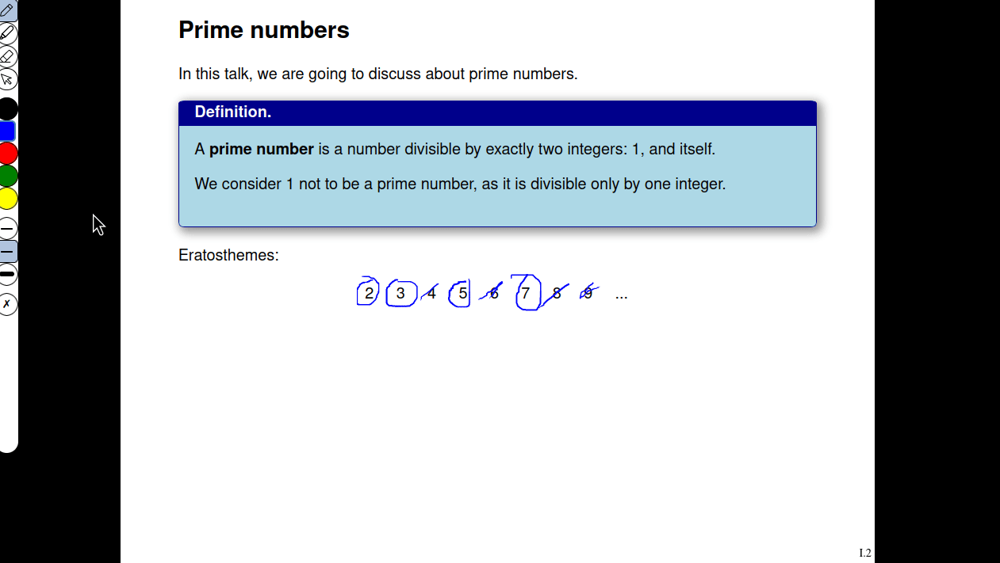

<div align="center"> 
  
 [Introduction](#slipshow-and-scrolling-presentations) [Documentation](#tutorial-api-and-documentation) [Examples](#examples) [Quickstart](#quick-start)</div>

---

## **Slipshow and scrolling presentations.**

In a slipshow presentation, the equivalent of a slide is called a _slip_. Each slip is like a slide, but with no bottom limit. That is, the content can be arbitrarily long! During the presentation, the camera will "scroll" down to reveal the hidden content, following a script given by the presenter!



Here are some properties of slipshow, in no specific orders:

- Fix some of the issues with slides by bringing back features of a blackboard presentation: keep some content while erasing the rest!
- Easy to write and readable syntax (markdown with few extensions). What you see is what you mean!
- Open the possibility for a more dynamic presentation, with annotations and animations.

Slipshow compiles files written in an extension of markdown, to a standalone html file viewable offline in any web browser.

If you want to see it in action, go to the [example section](#examples). If you want to start writing your presentation, go to [Quick start](#quick-start). Click for the [full documentation and API](#tutorial-api-documentation), or continue reading to know more about this project!

## The issue with traditional slides

When using traditional slides, you are given a rectangle of white space to express your thought. When this rectangle is full, you have no other choice than erasing everything, and start again with a new white rectangle.

This can be a problem both for the viewer and the presenter. If the viewer took some time understanding the beginning of the slide, they might miss the last part of a slide: everything will be erased before they have a chance to read it and catch up. And indeed, there is an obvious asymetry: the last part of a slide will be visible much shorter than the first part!

The presenter might want to show three information (`1`, `2` and `3`), each requiring the previous one to be visible on screen. However, all three information might not fit in one screen! When the first two are visible, it is necessary to... start again with a fresh slide, while we would like to keep information `2` visible.

Of course, for many kind of presentation, with very few content in the slide, this is not a problem at all. However, for some of them, it can be quite an issue! Having had many courses on various technical subjects (mostly math and computer science), I can see how slides degraded the experience from a blackboard presentation.

Instead of starting of with a fresh slide, a slipshow presentation "scrolls down" to reveal new space usable by the presenter, without hiding everything. This is much closer to what happens with a blackboard: the presenter can erase half of it, and continue with the new free space! And a viewer a little bit late still has a chance to catch up, since half of the information is still there.

## Examples

You can find several example of slip presentation, from different versions of slip. As they were from early stage of developpement, looking at the source code can be helpful but many things may have changed. Only the official example, tutorial and documentation are kept up to date.

- [The slips of my thesis](http://choum.net/panglesd/slides/slides-js/slides.html), the very first presentation that used (a very early version of) slipshow,
- [Some other technical presentation](https://choum.net/panglesd/slides/WDCM-2021-slips/wdcm-ada.html) (that also used an early version of the engine)
- [A presentation of slipshow](https://choum.net/panglesd/slides/campus_du_libre.html) in French. Source file [here](example/campus-du-libre/slipshow.md)!
- [A presentation on the BB(5) resolution](https://choum.net/panglesd/bbslides.html). See the [sources](https://github.com/meithecatte/bbslides/) (Disclaimer: I'm not the author of this presentation!)

Use the arrows to navigate in the presentation.

##  Tutorial, API and Documentation

You can find an extensive documentation, with a tutorial at the readthedocs [documentation](https://slipshow.readthedocs.io).

## Quick start

For a super quick start, just click visit [sliphub.choum.net](https://sliphub.choum.net) to start writing a presentation online.

For using slipshow offline, you'll need to install the slipshow tool. Currently, there are several ways to get it. The best is to download the precompiled binary from the [latest release](https://github.com/panglesd/slipshow/releases/latest).

Slipshow is also packaged as an `opam` package:

```shell
# For opam users.
$ opam install slipshow
```

Then, you can use the `slipshow` binary to compile a `.md` file to a slipshow presentation:

```shell
# Compile file.md into file.html:
$ slipshow compile file.md

# Watch for changes in the file, automatically recompiling:
$ slipshow watch file.md

# Watch for changes in the file, automatically recompiling and hot-reloadind the opened presentation:
$ slipshow serve file.md
```

You're ready to go! Have a look at the syntax, or the full tutorial for a more gentle introduction.

## Contributing

You can issue a Pull Request of any kind, report a bug, ask for a new feature, suggest an enhancement on the documentation (or make a Pull Request)... You can also [write a theme](https://slipshow.readthedocs.io/en/latest/themes.html#writing-a-theme).

## Acknowledgement

This project would never have been possible without open source! Programming with [OCaml](https://github.com/ocaml/ocaml) is a blast, thanks to everyone participating in its development.

Thanks to all the high quality libraries, either the [direct dependencies](https://github.com/panglesd/slipshow/blob/main/dune-project#L25-L48) or the vendored ones ([`brr`](https://erratique.ch/software/brr), [`cmarkit`](https://erratique.ch/software/cmarkit) and [`irmin-watcher`](https://github.com/mirage/irmin-watcher).)

Thanks to the [mathjax](https://www.mathjax.org/) project and [highlight-js](https://highlightjs.org/) for respectively powering math and syntax-highlighting.

I also would like to thank my parents for supporting me ever since I was young!

## Support

The NLNet Foundation is [sponsoring](https://nlnet.nl/project/Slipshow/) the development in 2025 through the [NGI Commons Fund](https://nlnet.nl/commonsfund/) with funds from the European Commission. Thanks a lot!

## License

GPLv3, with parts in ISC, DBS 3-Clause, Apache-2.0 and SIL OPEN FONT LICENSE Version 1.1. See [LICENSE.md](LICENSE.md) for more information.

