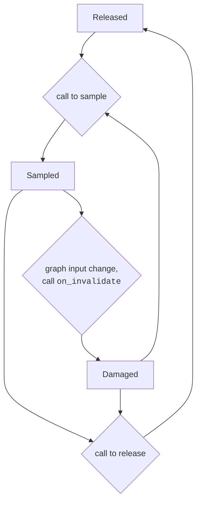

# Lwd: a "lightweight document" library

`Lwd` is a library that lets you build values that changes over time. It is a simple form of incremental computation, in the like of [Incremental](https://github.com/janestreet/incremental) and [React](https://github.com/dbuenzli/react).

It is only about interactivity. A bunch of companion libraries make it usable in different settings:

- [Nottui](lib/nottui) renders user interface in the terminal
- [Nottui-lwt](lib/nottui-lwt) add support for concurrent/asynchronous UI to Nottui 
- [Nottui-pretty](lib/nottui-pretty) is an interactive pretty-printer (based on [Pprint](https://github.com/fpottier/pprint))
- [Tyxml-lwd](lib/tyxml-lwd) is a Js_of_ocaml library for making interactive applications, using Lwd for updating the DOM and [Tyxml](https://github.com/ocsigen/tyxml) for writing typesafe HTML Document.

```shell
$ opam pin add tyxml https://github.com/ocsigen/tyxml.git#wraps
```

[TOC]

## Documents?

`Lwd` shines when constructing a single value, which we call a document, by aggregating many sub-documents. These sub-documents might be updated independently and we want to keep a consistent view on the aggregated document: when we observe it, it should be the aggregate of the sub-documents in their current version.

We will illustrate that with some examples. First we need to define the syntax for the final document:

```ocaml
type hypertext =
  | Text of string
  | Link of (unit -> unit) * hypertext
  | List of hypertext list
```

A value of type `hypertext` will be interpreted by a backend. The interpretation is roughly as follows:

- `Text str` simply displays the string `str` to the user (for instance on a terminal)
- `Link (callback, hypertext')` displays the document `hypertext'`.
  If the backend determines that the user is interacting with the content in this sub-document, `callback` is called.
- `List (doc1 :: doc2 :: ...)` displays `doc1` followed by `doc2` followed by `...`.

To keep the example simple, we didn't say anything about styling nor how interactions are determined. For instance, the backend could display plain text in a default color, switch to another color for text below a `Link _` constructor, and keep track of _focus_ by cycling between links when `<TAB>` is pressed and choosing a different color for the focused link.

A navigation menu could look like:

```ocaml
let newline = Text "\n" in
List [
  Text "Welcome to my cafe"; newline;
  Link (display_drink, Text "See drink options"); newline;
  Link (display_food, Text "See food options"); newline;
]
```

We don't yet know how to implement the `display_drink` and `display_food` function but we have  enough infrastructure to receive user intent. To complete the task, we will look at the idea of implementing a function that "changes its mind": it returned a value but, because of some circumstances, decide that another value should have been returned.

### Counting clicks

Let's imagine we want to make a button that counts the number of times it has been clicked: at first it displays 0, when triggered the 0 switch to 1, etc.

```ocaml
let counter = ref 0
let on_click () = counter := !counter + 1

let button clicks =
  Link (on_click, Text ("Clicked " ^ string_of_int clicks ^ " times"))
  
let document = button !counter 
```

We now have a counter that is incremented when the button is clicked. However the content of the button is not updated.

This is where `Lwd` comes into play: the `Lwd.var` type behaves almost like a reference but also tracks data dependencies. Let's update the example:

```ocaml
let counter = Lwd.var 0
let on_click () = Lwd.set counter (Lwd.peek counter + 1)

let button clicks =
  Link (on_click, Text ("Clicked " ^ string_of_int clicks ^ " times"))

let document = Lwd.map ~f:button (Lwd.get counter)
```

We make use of the following `Lwd` functions:

```ocaml
(* Variable manipulation function *)
val Lwd.var : 'a -> 'a Lwd.var
val Lwd.set : 'a Lwd.var -> 'a -> unit
val Lwd.peek : 'a Lwd.var -> 'a
```

`var`, `set` and `peek` behave like `ref`, `:=` and `!`. They allocate a mutable cell, change its value and read the value at current time. 

```ocaml
val Lwd.get : 'a Lwd.var -> 'a Lwd.t
```

`Lwd.get` reads a mutable cell, but while `Lwd.peek` returns the value immediately, `Lwd.get` lets you access the value wrapped in the `Lwd.t` type.

`Lwd` lets you build graph of computations with mutable inputs. The inputs or sources of the graph are made of `Lwd.var` while the inner nodes are built using combinators.

Here `Lwd.map : ~f:('a -> 'b) -> 'a Lwd.t -> 'b Lwd.t` apply a transformation to a varying value. That value might depend on arbitrary inputs, and if one of these input changes, the transformation will be recomputed too.

When the `Link` is triggered, the counter is incremented. Because `document` depends on the value of the counter it is invalidated. 

### Building computation graph

`Lwd.t` implements a few abstractions that should be familiar to seasoned functional programmers:

- it is a _functor_. With `Lwd.map : ~f:('a -> 'b) -> 'a Lwd.t -> 'b Lwd.t` you can transform values and chain the transformations
- it is an _applicative functor_. With `Lwd.map2 : ~f:('a -> 'b -> 'c) -> 'a Lwd.t -> 'b Lwd.t > 'c Lwd.t`  you can connect two different chains (making the computation tree shaped, actually with sharing it will form a DAG) 
- and, although this should in general be avoided, a _monad_. With `Lwd.join : 'a Lwd.t Lwd.t -> 'a Lwd.t` you can have a first pipeline that computes another pipeline and inject the inner one.

### Consuming computation graph

So far we described how to build values of type `a Lwd.t`  but we don't have a way to get access to those `a` outside of the _Lwd_ graph.

That's what `Lwd.root`s are for:

```ocaml
type 'a Lwd.root
val Lwd.observe : ?on_invalidate:('a -> unit) -> 'a t -> 'a root
val Lwd.set_on_invalidate : 'a root -> ('a -> unit) -> unit

val Lwd.sample : 'a root -> 'a
val Lwd.is_damaged : 'a root -> bool
val Lwd.release : 'a root -> unit
```

When you are interested in accessing the content of an `a Lwd.t` value, you create a root by `observe`-ing it. 

`Lwd.sample` lets you access the value at the current time.

After calling `Lwd.sample`, the `on_invalidate` callback might be invoked if the value is invalidated: some input changed, the value you sampled is out of date.

When you are done with the `root` and are no longer interested in observing the value, you should call `release`. This call to `release`  is very important: the `root` maintain the whole graph alive, so forgetting to `release` leads to memory leaks. After releasing, the on_invalidate callback will not be invoked.

A root can be in three possible states:

- released
- damaged
- sampled

When created, the root is in the `released` state: it does not maintain the graph alive.

Calling `sample` switches the root from the `released` to the `sampled` state. 



## Relation to HTML, DOM, and reactive UI libraries

**Syntax, data description and HTML.** To introduce our first example, we had to build a syntax using the simple `hypertext` algebraic data type. This type serves as an interface between the application and the interactive system: values of this type are produced by the front-end, like our example codes, and consumed by a back-end.

In the case of a web browser, the surface syntax is `HTML` which is much richer and more expressive than `hypertext` but ultimately is just data: a static description of some pieces of information.

**Adding programming languages.** Because static description are too limited for modern websites, Web browsers support the Javascript programming language. Pieces of javascript code can be put in the middle of the HTML syntax.

Similarly the `unit -> unit` parameter of the `Link` constructor allows to inject arbitrary OCaml code in the middle of an `hypertext` document.

**Making things interactive.** Being able to execute arbitrary piece of codes is not enough to make a document interactive: to make things dynamic the code needs to change the contents of the document in return.

Ultimately, interaction comes from this mutual dependency between document and code:

- the document contains codes that are executed in certain circumstances (determined by the meaning of elements of the document).
- when executed, a code can change the document, producing new elements associated to new codes.
- this updated document can then execute new pieces of code, that may update the document, and so on...

**The DOM.** Web browser's solution to allowing document update is the Document Object Model abstraction. The idea is to derive mutable data structures from the syntactic specification: each syntactic construction has a corresponding "DOM class" that can store the same information in mutable fields. Applied to our hypertext example:

```ocaml
type hypertext_dom =
  | Text of { mutable text: string }
  | Link of { mutable callback: (unit -> unit)
            ; mutable child: hypertext_dom }
  | List of { mutable children: hypertext_dom list }
```

While this might be a natural derivation in imperative languages, it proved difficult and error-prone to manipulate. Thousands of  Javascript libraries were proposed to ease DOM manipulation.

Some successful ones drew inspiration from functional programming, in the sense that they discouraged side-effects, producing new documents rather than modifying existing ones.

_Lwd_ rethinks this scaffolding: rather than starting from a static description, deriving mutable data structures to bring dynamism, and then restricting the mutations to make it manageable, we propose to keep the syntax as it is, lift the document in an  `Lwd.t` computation graph and use variables nodes to express parts that can changes.

**Reactive UI.** It is difficult to make a fair comparison with these libraries as the term is loosely defined and there many competing approaches. Furthermore Lwd can be presented as an alternative to the DOM so it is effective at a lower-level than what common reactive libraries target.

That being said, we will try to address the following questions:

- can reactive libraries, to a reasonable extent, be reimplemented on top of _Lwd_ rather than _DOM_?
- can _Lwd_ be conveniently used without such layer?

The first question can be answered positively with a naive encoding: put `Lwd.var` everywhere, essentially keeping enough "degrees of freedom" to change things as needed later. No static structure is enforced this way.

To answer the second question, it is interesting to observe that there is no concept of "diffing" here. _Lwd_ does not try to see if things have changed in order to update them. Rather, if an input change, the whole branch that depends on it is recomputed.

So it is not VDOM/Diffing that could make Lwd convenient. Instead, it is the fact that most of the time, dependencies are made explicit.
Let's consider a component that changes its color when it is focused. With `Lwd` (and `Nottui`), this could be expressed as:

```ocaml
let focus = Focus.make () in
let color status =
  if Focus.has_focus status then blue else black
in
button ~focus ~color:(Lwd.map ~f:color (Focus.status focus)))
```

The color of the button is defined declaratively: it cannot be changed elsewhere, no other part of the code can mutate it. It is this explicit declaration of dependencies that make it possible to reason about the code, to enforce invariants and to encapsulate behaviors.

`Lwd.var` is the escape hatch one can use to recover imperative code. But rather than being the default, it has to be opted in and can be exposed to a limited scope only.
