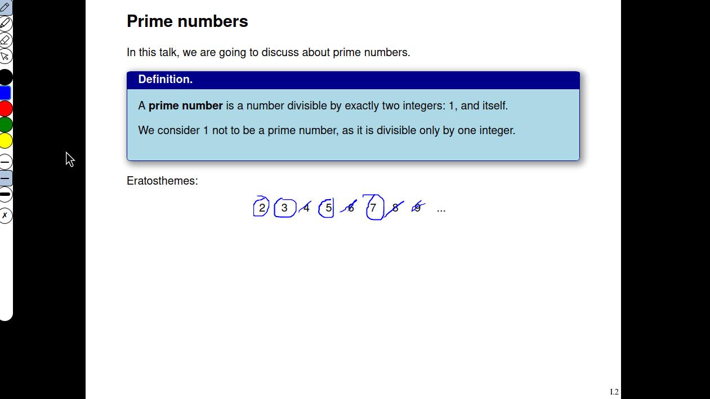

 

---

> [!Important]
>
> This page is about the *development* of Slipshow; if you are looking to *use* it, head to the official website at [slipshow.org](https://slipshow.org).

## Slipshow is all about *scrolling* presentations

In a Slipshow presentation, the equivalent of a slide is called a _slip_. Each slip is like a slide, but with no bottom limit. That is, the content can be arbitrarily long! During the presentation, the camera will "scroll" down to reveal the hidden content, following a script given by the presenter!

Slipshow improves on traditional slide-based presentations in the following ways:
- Scroll on a slip instead of changing slides, making content flow smoothly rather than in steps
- Record hand-drawings when preparing your talk, edit them, and have them replayed during the presentation
- Include custom scripts to make your presentation clearer through e.g. animation or interaction.

Slipshow compiles files written in an extension of [Markdown](https://en.wikipedia.org/wiki/Markdown), to a standalone HTML file viewable offline in any web browser.

##  Tutorial, API and Documentation

Slipshow has [extensive documentation](https://docs.slipshow.org), including a tutorial.

## Contributing

Slipshow's development happens on [GitHub](https://github.com/panglesd/slipshow). On here you can report bugs, ask for new features, suggest enhancements, improve documentation,  [create a theme](https://slipshow.readthedocs.io/en/latest/themes.html#writing-a-theme), and of course help out by creating pull requests — but be sure to read the [contributing guide](CONTRIBUTING.md) first.

## Recent changes

You'll find recent changes in Slipshow in the [changelog](CHANGELOG.md).

## Support

The NLNet Foundation is [sponsoring Slipshow](https://nlnet.nl/project/Slipshow/) the development in 2025 through the [NGI Commons Fund](https://nlnet.nl/commonsfund/) with funds from the European Commission. Thanks a lot!

## License

Slipshow is distributed under the GPLv3 license, with parts in ISC, DBS 3-Clause, Apache-2.0 and SIL OPEN FONT LICENSE Version 1.1. See [LICENSE.md](LICENSE.md) for more information.
