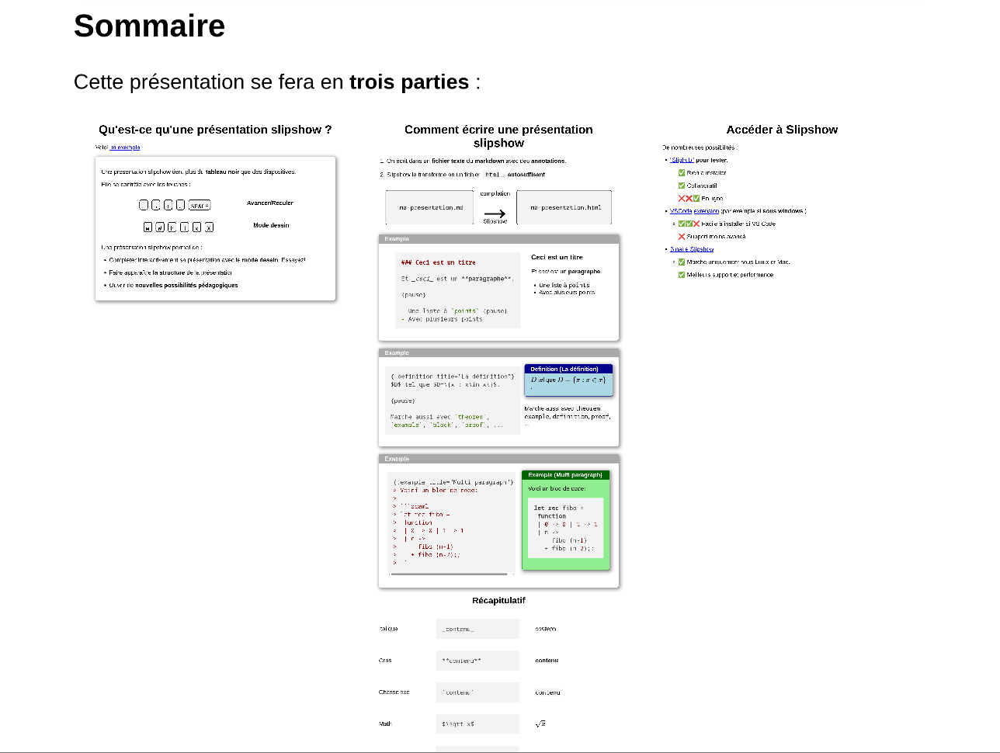
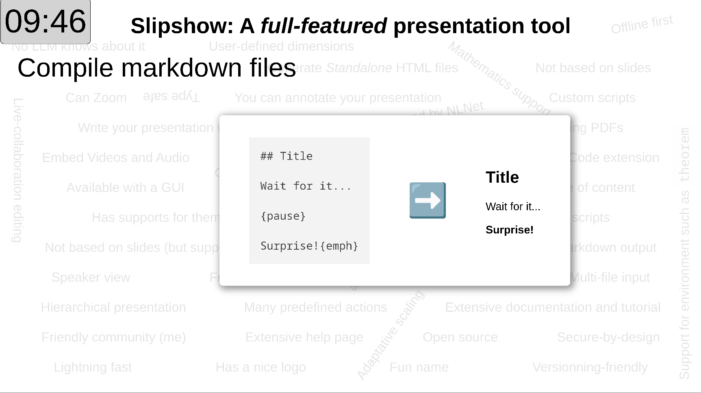
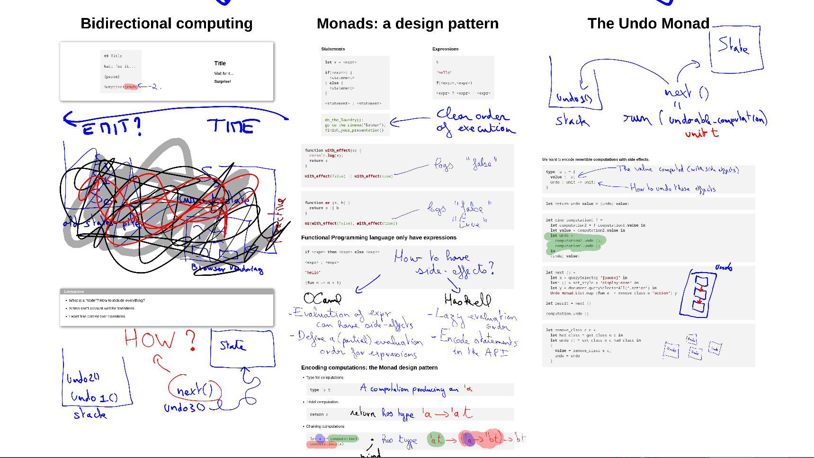

========
Examples
========

In this page, you'll find a number of examples of "real life" Slipshow
presentation. This can help in two ways:

- It can give you an idea of what you can do with Slipshow, especially if you
  are only used to slides.
- You can peek at the source to learn how to achieve certain effects, if you
  don't find them in the doc or want bigger examples.

I'm the author of some presentations, other are authored by other person who
kindly allowed me to list them here. Some of them have have the source
available, other keep it private.

I will make sure that my own presentations always work with the latest version
of Slipshow. However, "external" presentations might require an older version of
Slipshow.

Note also that being "real-life" presentation, they were made under time
constraints, sometimes using older versions with less features in the
language. So the code is probably not the cleanest, and that is fine.

See: :github_src:`example/`

Campus du libre
===============

   The "Campus du libre" presentation

:Type: Typed presentation
:Author: Me!
:Date: 2024
:Slipshow version: Latest (presentation kept up to date)
:Theme: Slipshow
:Source: :github_src:`example/cdl/`
:Rendered: `cdl.html`_

FunOCaml
========

   The "FunOCaml" presentation

:Type: Typed presentation
:Author: Me!
:Slipshow version: Latest (presentation kept up to date)
:Date: 2025
:Theme: Slipshow and Computer Science
:Source: :github_src:`example/funocaml/`
:Rendered version: https://choum.net/panglesd/slides/funocaml.html

The Undo Monad
==============

   The "Undo Monad" presentation

:Type: Typed and drawn presentation
:Author: Me!
:Slipshow version: Latest (presentation kept up to date)
:Date: 2025
:Theme: Computer Science
:Source: :github_src:`example/undo-monad/`
:Rendered version: `https://choum.net/panglesd/slides/undo-monad.html`_

Infinite Computations in Algorithmic Randomness and Reverse Mathematics
=======================================================================

:Type: Typed presentation
:Author: Me!
:Slipshow version: Very old
:Date: 2019
:Source: ...
:Rendered version: ...
:Theme: Computer Science

.. note::

   The first ever Slipshow presentation!

The computable strength of Milliken's Tree Theorem and applications
===================================================================

:Type: Typed presentation
:Author: Me!
:Slipshow version: Very old
:Date: ...
:Source: ...
:Rendered version: ...
:Theme: Mathematics

Busy beaver
===========

:Type: Typed presentation with custom scripts
:Author: Meithecatte and others
:Slipshow version: ...
:Date: ...
:Source: ...
:Rendered version: ...
:Theme: Mathematics

Myriam
======

:Type: Typed presentation
:Author: Myriam Preissmann
:Slipshow version: ...
:Date: ...
:Source: ...
:Rendered version: ...
:Theme: Mathematics

Lysxia
======

:Type: Typed presentation
:Author: Li-yao Xia
:Slipshow version: ...
:Date: 2025
:Source: https://gitlab.com/lysxia/prez/-/blob/main/defunctionalization-lmf.md?ref_type=heads
:Rendered version: https://poisson.chat/aquarium/defunctionalization-lmf.html
:Theme: Computer Science

Structures et équations de graphes sourcés : petite largeur arborescente et chemins disjoints
=============================================================================================

:Type: Typed presentation
:Author: Samuel Humeau
:Slipshow version: ...
:Date: 2025
:Source: No source
:Rendered version: https://perso.ens-lyon.fr/samuel.humeau/pages/slides.html
:Theme: Computer Science

