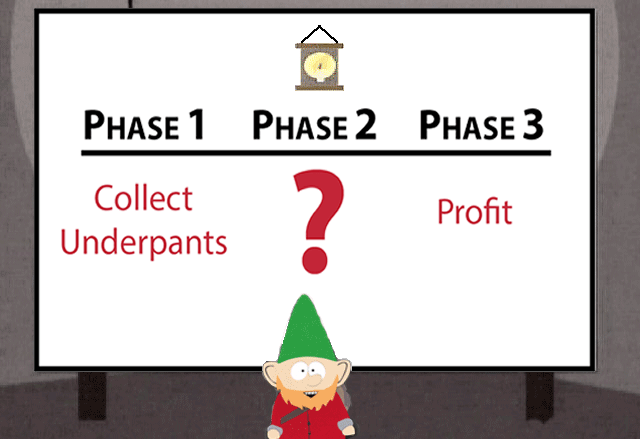

=========================================
 A visual structure for the presentation
=========================================

In this tutorial, we'll learn to :

- Lay out the presentation, using CSS,
- Use subslips to "enter" a part of the big-picture for a deep-dive,
- Organize a Slipshow presentation in multiple files.

We'll use those to make the structure of the presentation (the different parts
and how they organize) visually obvious. That hopefully helps the audience get
the big picture, and get back on board if some part goes too deep!

This is a more advanced tutorial, which requires to know the basics of
Slipshow. Some familiarity with CSS will help, do not hesitate to learn a bit of
it in a specialized resource if you feel you need it.

The topic of today
==================

Just as for every Slipshow tutorial, we need a subject for the presentation we
will make.

Suppose you are a Gnome, and you want to present your `genius business plan
<https://en.wikipedia.org/wiki/Gnomes_(South_Park)>`_. (This business plan is
very close to Slipshow's business plan, only the first phase being different.)

         Phase 2: ?, Phase 3: Profit.

   A gnome presenting their Slipshow

The plan as presented above is very clear. The three parts are very easily
identifiable, and it's easy to see how they linearly organize. The details of
each phases, particularly the 1 and 3, could however be improved.

We are going to make a Slipshow presentation with a bit more details on each
phase. However, we do not want to lose anything on the clarity of the big
picture. Moreover, we want it to be easy to know what phase we are focusing on.

Our plan will be the following:

1. We'll reproduce the initial Gnome's layout,
2. We'll add dynamics with subslips,
3. We'll go deeper by fixing details,
4. ?
5. Profit

The initial Gnome layout
========================

Let's recreate the Gnome layout in Slipshow. We'll make a simplified version,
and learn a lot along the way.

.. note::

   Usually, it is a good idea to decide on the dimension of your
   presentation. 16:9 is very often the best fit, but here we are going with the
   4:3 default. Even though it is the default, we specify it.

So, let's start with the small clock at the top. We could use an image... But
let's simply add an emoji: ``🕰️``! Create a ``gnome.md`` file with the following
content:

.. slipshow-example::
   :visible: both
   :dimension: 4:3

   ---
   dimension: 4:3
   ---

   # 🕰️

.. note::

   If you compile the slipshow presentation we are building on your own
   computer, which I advise to do, use hot-reload with slipshow serve:

   .. code-block::

      $ slipshow serve gnome.md

   You'll be all-set to go in the vegetable of the subject!

This poor clock feels very small. Let's make it bigger. In Slipshow, we
manipulate the stylistic properties of elements with CSS, a very powerful
language. Let's give an attribute to the clock, setting the ``style`` attribute
to be ``font-size:150px``.

.. slipshow-example::
   :dimension: 4:3

   ---
   dimension: 4:3
   ---

   # 🕰️{style="font-size:150px"}

That is better! Everything inside ``style`` is interpreted as CSS properties and
applied to the element the metadata is attached to (the clock in this case). CSS
properties are key-value pairs, for instance ``font-size`` and ``150px``. Some
of them are self-explanatory, some of them are more tricky.

Now, we want to layout the three phases in three columns. So the markup will look like this:

.. code-block::

   {.columns-3 #phases}
   ---

   # Phase 1

   # Phase 2

   # Phase 3

   ---

We have three titles in a block. We will now format the block and titles so that
they are layout in three columns. Again, we will do that using CSS. Unless this
time, we are not going to directly style the elements by attaching style to
them. We are going to write the CSS elsewhere in the file, referencing the
elements via their identifiers or classes.

We have two CSS tasks. One is to turn the above into a three layout columns. We
are going to use CSS's Flexbox to do that:

.. code-block:: css

   .columns-3 {
     display: flex;
   }
   .columns-3 > * {
     width: 33%;
   }

Finally, we are going to add the black horizontal line below the phases by adding
a large bottom border: ``border-bottom: 10px solid black``.

.. code-block:: css

   #phases {
     border-bottom: 10px solid black
   }

Which gives us:

.. slipshow-example::
   :dimension: 4:3

   ---
   dimension: 4:3
   ---

   # 🕰️{style="font-size:150px"}

   {.columns-3 #phases}
   ---

   # Phase 1

   # Phase 2

   # Phase 3

   ---

   

Wow, that starts to look like the original! Now, we want to add the description
of the phases in red. We'll layout them as columns, using the ``columns-3``
class we have defined.

.. slipshow-example::
   :dimension: 4:3

   ---
   dimension: 4:3
   ---

   # 🕰️{style="font-size:150px"}

   {.columns-3 #phases}
   ---

   # Phase 1

   # Phase 2

   # Phase 3

   {.columns-3}
   ---

   > {.super-title}
   > # Collect underpants

   > {.super-title}
   > # ?

   > {.super-title}
   > # Profit
   ---

   

We now have a similar layout to the original one. We'll improve it later in this
tutorial, but for now, we are ready to add some dynamics to it.

Adding dynamics with subslips
=============================

Currently, our slipshow has no dynamics: no step, it is just a static
presentation. There are no actions, such as the ``up`` and ``draw`` actions we
have already seen in previous tutorials. This time, we are going to add
something very specific to Slipshow: a slip (also called subslip, as it is
itself inside a slip).

Slips are similar to slides, but with no bottom limit. We scroll through them with actions such as ``up``. This should sound familiar, as up until now, we've always been in a slip. What is new is that we will now have slips *inside* slips.

Including a subslip is done by giving the ``slip`` attribute. This attribute has two effects:

- It defines the look of the element,
- It acts as an action: the ``enter`` action, which zooms and moves the sliding
  window to align with its top part.

This is a lot of explanation, but in practice it is actually relatively easy. Let's just replace our three details with three subslips.

.. code-block:: diff

    {.columns-3}
    ---

   +{slip}
    > {.super-title}
    > # Collect underpants

   +{slip}
    > {.super-title}
    > # ?

   +{slip}
    > {.super-title}
    > # Profit
   ---

And that's it! Let's look at the result. Click on the presentation to focus it and use the arrow keys to navigate the presentation.

.. slipshow-example::
   :dimension: 4:3
   :visible: presentation

   ---
   dimension: 4:3
   ---

   # 🕰️{style="font-size:150px"}

   {.columns-3 #phases}
   ---

   # Phase 1

   # Phase 2

   # Phase 3

   {.columns-3}
   ---

   {slip}
   > {.super-title}
   > # Collect underpants

   {slip}
   > {.super-title}
   > # ?

   {slip}
   > {.super-title}
   > # Profit
   ---

   

What to notice here?

- The titles are now much smaller, they are exactly the size to make them
  normally big when you enter the slip.
- The ``enter`` actions (derived from the fact that there are ``slips``) are
  executed one after the other. So we visit the three slips in order of their
  definition. Maybe we want to control that better, we'll see that later.

Let's make the titles bigger (using ``font-size``) and adds some "LLoreM ipsum"
text to fill the empty subslips.

.. code-block:: diff

    {slip}
    > {.super-title}
    > # Collect underpants
   +>
   +> {#overview}
   +> # Overview
   +>
   +> - Equipment
   +> - The heist
   +> - Common mistakes
   +>
   +> [...]
   +> - Arguing about lace vs. cotton

    [...]

    {slip}
    > {.super-title}
    > # Profit
   +>
   +> # What Is Profit?
   +>
   +> [...]
   +> - Proceed as planned

    [...]

    .super-title {
      color: red;
   +  font-size: 200px;
    }

.. slipshow-example::
   :dimension: 4:3
   :visible: presentation

   ---
   dimension: 4:3
   ---

   # 🕰️{style="font-size:150px"}

   {.columns-3 #phases}
   ---

   # Phase 1

   # Phase 2

   # Phase 3

   {.columns-3}
   ---

   {slip}
   > {.super-title}
   > # Collect underpants
   >
   > {#overview}
   > # Overview
   >
   > - Equipment
   > - The heist
   > - Common mistakes
   >
   > {pause up=overview}
   > # Equipment
   >
   > - Pointy hat (mandatory)
   > - Tiny ladder
   > - Large sack labeled **“NOT SUSPICIOUS”**
   >
   > {pause}
   > # The Heist
   >
   > - 🕒 Operate between **2:00 and 4:00 AM**
   > - 🤫 Avoid squeaky floors
   > - 🩲 Always grab the freshest pair
   >
   > {pause down=mistakes}
   > # Common Mistakes
   >
   > {.block title=Warnings #mistakes}
   > - Confusing socks with underpants
   > - Tickling the human *(never do this)*
   > - Arguing about lace vs. cotton

   {slip}
   > {.super-title}
   > # ?{style=font-size:400px}

   {slip}
   > {.super-title}
   > # Profit
   >
   > # What Is Profit?
   >
   > - Money left over
   > - After *everything* else
   > - Including the things you forgot to budget for
   >
   > {pause}
   >
   > {#illusion}
   > # The Illusion of Control
   >
   > - Charts create confidence
   > - Confidence creates trust
   > - Trust allows pricing
   >
   > {pause up=illusion}
   > # Revenue Streams
   >
   > - Primary income
   > - Secondary income
   > - “This wasn’t supposed to make money” income
   >
   > {pause}
   >
   > # Cost Optimization
   >
   > - Spend less than last time
   > - Rebrand cuts as “efficiency”
   > - Cancel tools nobody remembers subscribing to
   >
   > {pause}
   >
   > {#pricing}
   > # Pricing Strategy
   >
   > - Round numbers feel honest
   > - Odd numbers feel scientific
   > - Higher numbers feel premium
   >
   > {pause up=pricing}
   > # Scaling Up
   >
   > - Do the same thing
   > - More times
   > - With fewer humans involved
   >
   > {pause}
   >
   > # Profit Metrics
   >
   > - Growth (always up and to the right)
   > - Margins (explained vaguely)
   > - KPIs (defined after the meeting)
   >
   > {pause}
   >
   > # Ethics & Responsibility
   >
   > - Publish a mission statement
   > - Use words like “sustainable”
   > - Proceed as planned

   ---

   

Polishing the presentation
==========================

In this section, we are going to polish the whole presentation.

We are going to do the following:

- Remove the text that appear below the titles before we enter the slide,
- Unzoom to show the big picture in between phases,
- Show "Phase ..." when entering the slide,
- Make the presentation more similar to the original image,
- Split the source into multiple files.

Hiding until entering
---------------------

You probably have noticed that the first step of the presentation does not look
like the original image anymore: it has the first paragraph of the subslips
already written. We would like to have it shown when we enter the slip. A first step is to add a ``pause`` action.

.. code-block:: diff

   {slip}
    > {.super-title}
    > # Collect underpants
    >
   -> {#overview}
   +> {#overview pause}
    > # Overview

and

.. code-block:: diff

    {slip}
    > {.super-title}
    > # Profit
    >
   +> {pause}
    > # What Is Profit?

.. slipshow-example::
   :dimension: 4:3
   :visible: presentation

   ---
   dimension: 4:3
   ---

   # 🕰️{style="font-size:150px"}

   {.columns-3 #phases}
   ---

   # Phase 1

   # Phase 2

   # Phase 3

   {.columns-3}
   ---

   {slip}
   > {.super-title}
   > # Collect underpants
   >
   > {#overview pause}
   > # Overview
   >
   > - Equipment
   > - The heist
   > - Common mistakes
   >
   > {pause up=overview}
   > # Equipment
   >
   > - Pointy hat (mandatory)
   > - Tiny ladder
   > - Large sack labeled **“NOT SUSPICIOUS”**
   >
   > {pause}
   > # The Heist
   >
   > - 🕒 Operate between **2:00 and 4:00 AM**
   > - 🤫 Avoid squeaky floors
   > - 🩲 Always grab the freshest pair
   >
   > {pause down=mistakes}
   > # Common Mistakes
   >
   > {.block title=Warnings #mistakes}
   > - Confusing socks with underpants
   > - Tickling the human *(never do this)*
   > - Arguing about lace vs. cotton

   {slip}
   > {.super-title}
   > # ?{style=font-size:400px}

   {slip}
   > {.super-title}
   > # Profit
   >
   > {pause}
   > # What Is Profit?
   >
   > - Money left over
   > - After *everything* else
   > - Including the things you forgot to budget for
   >
   > {pause}
   >
   > {#illusion}
   > # The Illusion of Control
   >
   > - Charts create confidence
   > - Confidence creates trust
   > - Trust allows pricing
   >
   > {pause up=illusion}
   > # Revenue Streams
   >
   > - Primary income
   > - Secondary income
   > - “This wasn’t supposed to make money” income
   >
   > {pause}
   >
   > # Cost Optimization
   >
   > - Spend less than last time
   > - Rebrand cuts as “efficiency”
   > - Cancel tools nobody remembers subscribing to
   >
   > {pause}
   >
   > {#pricing}
   > # Pricing Strategy
   >
   > - Round numbers feel honest
   > - Odd numbers feel scientific
   > - Higher numbers feel premium
   >
   > {pause up=pricing}
   > # Scaling Up
   >
   > - Do the same thing
   > - More times
   > - With fewer humans involved
   >
   > {pause}
   >
   > # Profit Metrics
   >
   > - Growth (always up and to the right)
   > - Margins (explained vaguely)
   > - KPIs (defined after the meeting)
   >
   > {pause}
   >
   > # Ethics & Responsibility
   >
   > - Publish a mission statement
   > - Use words like “sustainable”
   > - Proceed as planned

   ---

   

This is a good start, but you need to press the right arrow key *twice*: once to
enter the slips, once to show the first paragraph. We can change that by simply
*moving the pause action to execute at the same time as the enter action*. To do
that, we have to give an argument to the ``pause`` action.

.. code-block:: diff

   -{slip}
   +{slip pause=overview}
    > {.super-title}
    > # Collect underpants
    >
   -> {#overview pause}
   +> {#overview}
    > # Overview

and

.. code-block:: diff

   -{slip}
   +{slip pause=wat-profit}
    > {.super-title}
    > # Profit
    >
   +> {#wat-profit}
    > # What Is Profit?

.. slipshow-example::
   :dimension: 4:3
   :visible: presentation

   ---
   dimension: 4:3
   ---

   # 🕰️{style="font-size:150px"}

   {.columns-3 #phases}
   ---

   # Phase 1

   # Phase 2

   # Phase 3

   {.columns-3}
   ---

   {slip pause=overview}
   > {.super-title}
   > # Collect underpants
   >
   > {#overview}
   > # Overview
   >
   > - Equipment
   > - The heist
   > - Common mistakes
   >
   > {pause up=overview}
   > # Equipment
   >
   > - Pointy hat (mandatory)
   > - Tiny ladder
   > - Large sack labeled **“NOT SUSPICIOUS”**
   >
   > {pause}
   > # The Heist
   >
   > - 🕒 Operate between **2:00 and 4:00 AM**
   > - 🤫 Avoid squeaky floors
   > - 🩲 Always grab the freshest pair
   >
   > {pause down=mistakes}
   > # Common Mistakes
   >
   > {.block title=Warnings #mistakes}
   > - Confusing socks with underpants
   > - Tickling the human *(never do this)*
   > - Arguing about lace vs. cotton

   {slip}
   > {.super-title}
   > # ?{style=font-size:400px}

   {slip pause=wat-profit}
   > {.super-title}
   > # Profit
   >
   > {#wat-profit}
   > # What Is Profit?
   >
   > - Money left over
   > - After *everything* else
   > - Including the things you forgot to budget for
   >
   > {pause}
   >
   > {#illusion}
   > # The Illusion of Control
   >
   > - Charts create confidence
   > - Confidence creates trust
   > - Trust allows pricing
   >
   > {pause up=illusion}
   > # Revenue Streams
   >
   > - Primary income
   > - Secondary income
   > - “This wasn’t supposed to make money” income
   >
   > {pause}
   >
   > # Cost Optimization
   >
   > - Spend less than last time
   > - Rebrand cuts as “efficiency”
   > - Cancel tools nobody remembers subscribing to
   >
   > {pause}
   >
   > {#pricing}
   > # Pricing Strategy
   >
   > - Round numbers feel honest
   > - Odd numbers feel scientific
   > - Higher numbers feel premium
   >
   > {pause up=pricing}
   > # Scaling Up
   >
   > - Do the same thing
   > - More times
   > - With fewer humans involved
   >
   > {pause}
   >
   > # Profit Metrics
   >
   > - Growth (always up and to the right)
   > - Margins (explained vaguely)
   > - KPIs (defined after the meeting)
   >
   > {pause}
   >
   > # Ethics & Responsibility
   >
   > - Publish a mission statement
   > - Use words like “sustainable”
   > - Proceed as planned

   ---

   

Showing the big picture in between steps
----------------------------------------

Slipshow will exit a slip if the current action to execute it is not included in
it. In this case, we can thus just add ``step`` actions (which do nothing on
their own) to exit to the containing slip in between the subslips. We can also
add one step at the end to end on the big picture.

For the two steps in between the subslips:

.. code-block:: diff

    > {pause down=mistakes}
    > # Common Mistakes
    >
    > {.block title=Warnings #mistakes}
    > - Confusing socks with underpants
    > - Tickling the human *(never do this)*
    > - Arguing about lace vs. cotton

   +{step style=width:0}

    {slip}
    > {.super-title}
    > # ?{style=font-size:400px}

   +{step style=width:0}

    {slip pause=wat-profit}
    > {.super-title}
    > # Profit
    >
    > {#wat-profit}
    > # What Is Profit?

And for the last step back to the main slip:

.. code-block:: diff

    > # Ethics & Responsibility
    >
    > - Publish a mission statement
    > - Use words like “sustainable”
    > - Proceed as planned

    ---

   +{step}

.. slipshow-example::
   :dimension: 4:3
   :visible: presentation

   ---
   dimension: 4:3
   ---

   # 🕰️{style="font-size:150px"}

   {.columns-3 #phases}
   ---

   # Phase 1

   # Phase 2

   # Phase 3

   {.columns-3}
   ---

   {slip pause=overview}
   > {.super-title}
   > # Collect underpants
   >
   > {#overview}
   > # Overview
   >
   > - Equipment
   > - The heist
   > - Common mistakes
   >
   > {pause up=overview}
   > # Equipment
   >
   > - Pointy hat (mandatory)
   > - Tiny ladder
   > - Large sack labeled **“NOT SUSPICIOUS”**
   >
   > {pause}
   > # The Heist
   >
   > - 🕒 Operate between **2:00 and 4:00 AM**
   > - 🤫 Avoid squeaky floors
   > - 🩲 Always grab the freshest pair
   >
   > {pause down=mistakes}
   > # Common Mistakes
   >
   > {.block title=Warnings #mistakes}
   > - Confusing socks with underpants
   > - Tickling the human *(never do this)*
   > - Arguing about lace vs. cotton

   {step style=width:0}

   {slip}
   > {.super-title}
   > # ?{style=font-size:400px}

   {step style=width:0}

   {slip pause=wat-profit}
   > {.super-title}
   > # Profit
   >
   > {#wat-profit}
   > # What Is Profit?
   >
   > - Money left over
   > - After *everything* else
   > - Including the things you forgot to budget for
   >
   > {pause}
   >
   > {#illusion}
   > # The Illusion of Control
   >
   > - Charts create confidence
   > - Confidence creates trust
   > - Trust allows pricing
   >
   > {pause up=illusion}
   > # Revenue Streams
   >
   > - Primary income
   > - Secondary income
   > - “This wasn’t supposed to make money” income
   >
   > {pause}
   >
   > # Cost Optimization
   >
   > - Spend less than last time
   > - Rebrand cuts as “efficiency”
   > - Cancel tools nobody remembers subscribing to
   >
   > {pause}
   >
   > {#pricing}
   > # Pricing Strategy
   >
   > - Round numbers feel honest
   > - Odd numbers feel scientific
   > - Higher numbers feel premium
   >
   > {pause up=pricing}
   > # Scaling Up
   >
   > - Do the same thing
   > - More times
   > - With fewer humans involved
   >
   > {pause}
   >
   > # Profit Metrics
   >
   > - Growth (always up and to the right)
   > - Margins (explained vaguely)
   > - KPIs (defined after the meeting)
   >
   > {pause}
   >
   > # Ethics & Responsibility
   >
   > - Publish a mission statement
   > - Use words like “sustainable”
   > - Proceed as planned

   ---

   {step}

   

Showing Phase element when entering
-----------------------------------

Similarly as when we are using ``pause`` action at the same time as the
``enter`` action, we can also use the ``up`` action to modify the target
position of the sliding window:

.. code-block:: diff

   -{slip pause=overview}
   +{slip pause=overview up=phase-1}

    [...]

   -{slip}
   +{slip up=phase-2}

    [...]

   -{slip pause=wat-profit}
   +{slip pause=wat-profit up=phase-3}

.. slipshow-example::
   :dimension: 4:3
   :visible: presentation

   ---
   dimension: 4:3
   ---

   # 🕰️{style="font-size:150px"}

   {.columns-3 #phases}
   ---

   {#phase-1}
   # Phase 1

   {#phase-2}
   # Phase 2

   {#phase-3}
   # Phase 3

   {.columns-3}
   ---

   {slip pause=overview up=phase-1}
   > {.super-title}
   > # Collect underpants
   >
   > {#overview}
   > # Overview
   >
   > - Equipment
   > - The heist
   > - Common mistakes
   >
   > {pause up=overview}
   > # Equipment
   >
   > - Pointy hat (mandatory)
   > - Tiny ladder
   > - Large sack labeled **“NOT SUSPICIOUS”**
   >
   > {pause}
   > # The Heist
   >
   > - 🕒 Operate between **2:00 and 4:00 AM**
   > - 🤫 Avoid squeaky floors
   > - 🩲 Always grab the freshest pair
   >
   > {pause down=mistakes}
   > # Common Mistakes
   >
   > {.block title=Warnings #mistakes}
   > - Confusing socks with underpants
   > - Tickling the human *(never do this)*
   > - Arguing about lace vs. cotton

   {step style=width:0}

   {slip up=phase-2}
   > {.super-title}
   > # ?{style=font-size:400px}

   {step style=width:0}

   {slip pause=wat-profit up=phase-3}
   > {.super-title}
   > # Profit
   >
   > {#wat-profit}
   > # What Is Profit?
   >
   > - Money left over
   > - After *everything* else
   > - Including the things you forgot to budget for
   >
   > {pause}
   >
   > {#illusion}
   > # The Illusion of Control
   >
   > - Charts create confidence
   > - Confidence creates trust
   > - Trust allows pricing
   >
   > {pause up=illusion}
   > # Revenue Streams
   >
   > - Primary income
   > - Secondary income
   > - “This wasn’t supposed to make money” income
   >
   > {pause}
   >
   > # Cost Optimization
   >
   > - Spend less than last time
   > - Rebrand cuts as “efficiency”
   > - Cancel tools nobody remembers subscribing to
   >
   > {pause}
   >
   > {#pricing}
   > # Pricing Strategy
   >
   > - Round numbers feel honest
   > - Odd numbers feel scientific
   > - Higher numbers feel premium
   >
   > {pause up=pricing}
   > # Scaling Up
   >
   > - Do the same thing
   > - More times
   > - With fewer humans involved
   >
   > {pause}
   >
   > # Profit Metrics
   >
   > - Growth (always up and to the right)
   > - Margins (explained vaguely)
   > - KPIs (defined after the meeting)
   >
   > {pause}
   >
   > # Ethics & Responsibility
   >
   > - Publish a mission statement
   > - Use words like “sustainable”
   > - Proceed as planned

   ---

   {step}

   

Splitting the source in multiple files
--------------------------------------

As you probably have thought, the current file is starting to be difficult to
edit, due to its length, the grouping of elements... It is a good idea to split
your source in multiple files to improve readability. In our case, we'll have
several files:

- One "entry" file, with the structure of the talk (``gnome.md``),
- One file for ``Phase 1``, and one file for ``Phase 2``,
- One file for the CSS styling.

Let's start with the entry point file. In this file, we are going to include
``phase-1.md`` and ``phase-3.md`` with the ``include`` attribute, and we'll
include the style by adding the ``css`` field to the frontmatter.

Modify ``gnome.md`` to be:

.. code-block:: diff

   +---
   +css: style.css
   +---

    # 🕰️{style="font-size:150px"}

    {.columns-3 #phases}
    ---

    {#phase-1}
    # Phase 1

    {#phase-2}
    # Phase 2

    {#phase-3}
    # Phase 3

    {.columns-3}
    ---

    {slip pause=overview up=phase-1}
   -> [...]
   +{include src=phase-1.md}

    {step style=width:0}

    {slip up=phase-2}
    > {.super-title}
    > # ?{style=font-size:400px}

    {step style=width:0}

    {slip pause=wat-profit up=phase-3}
   -> [...]
   +{include src=phase-3.md}

   ---

   {step}

Now, create ``style.css` containing exactly what used to be inside the ``<style>`` element:

.. code-block::

   .columns-3 {
     display: flex;
   }
   .columns-3 > * {
     width: 33%;
   }
   #phases {
     border-bottom: 10px solid black
   }
   .super-title {
     color: red;
     font-size: 200px;
   }

Now, ``phase-1.md`` with an unchanged LLoreM ipsum:

.. code-block::

   {.super-title}
   # Collect underpants

   {#overview}
   # Overview

   - Equipment
   - The heist
   - Common mistakes

   {pause up=overview}
   # Equipment

   - Pointy hat (mandatory)
   - Tiny ladder
   - Large sack labeled **“NOT SUSPICIOUS”**

   {pause}
   # The Heist

   - 🕒 Operate between **2:00 and 4:00 AM**
   - 🤫 Avoid squeaky floors
   - 🩲 Always grab the freshest pair

   {pause down=mistakes}
   # Common Mistakes

   {.block title=Warnings #mistakes}
   - Confusing socks with underpants
   - Tickling the human *(never do this)*
   - Arguing about lace vs. cotton

And, finally ``phase-3.md`` also with an unchanged LLoreM ipsum:

.. code-block::

   {.super-title}
   # Profit

   {#wat-profit}
   # What Is Profit?

   - Money left over
   - After *everything* else
   - Including the things you forgot to budget for

   {pause}

   {#illusion}
   # The Illusion of Control

   - Charts create confidence
   - Confidence creates trust
   - Trust allows pricing

   {pause up=illusion}
   # Revenue Streams

   - Primary income
   - Secondary income
   - “This wasn’t supposed to make money” income

   {pause}

   # Cost Optimization

   - Spend less than last time
   - Rebrand cuts as “efficiency”
   - Cancel tools nobody remembers subscribing to

   {pause}

   {#pricing}
   # Pricing Strategy

   - Round numbers feel honest
   - Odd numbers feel scientific
   - Higher numbers feel premium

   {pause up=pricing}
   # Scaling Up

   - Do the same thing
   - More times
   - With fewer humans involved

   {pause}

   # Profit Metrics

   - Growth (always up and to the right)
   - Margins (explained vaguely)
   - KPIs (defined after the meeting)

   {pause}

   # Ethics & Responsibility

   - Publish a mission statement
   - Use words like “sustainable”
   - Proceed as planned

Note that ``slipshow serve``, which hot reloads on change, will hot-reload on
changes on any of the dependent files.

?
=

Profit
======

If you'd like to contribute, I accept donations through `Github Sponsor <https://github.com/sponsors/panglesd>`_!
