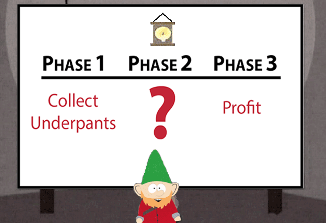

=========================================
 A visual structure for the presentation
=========================================

In this tutorial, we'll learn to :

- Lay out the presentation using CSS,
- Use _subslips_ to "enter" a part of the big picture for a deeper dive,
- Organize a Slipshow presentation into multiple files.

We'll use those features to make the structure of the presentation (its various parts
and how they are organized) visually obvious. Hopefully, that will help your audience appreciate
the big picture, and provide vital context to get them back on track if some parts go too deep.

This is a more advanced tutorial for which you'll need to know the basics of
Slipshow that we covered in :ref:`tutorial`. Familiarity with CSS will help, so don't
hesitate to refer to more specialised CSS documentation and tutorials if you feel you need it.

The topic of today
==================

Just as for every Slipshow tutorial, our presentation needs a subject.

Suppose you are a Gnome, and you want to present your `genius business plan
<https://en.wikipedia.org/wiki/Gnomes_(South_Park)>`_. (This business plan is
very close to Slipshow's business plan, only the first phase being different.)

         Phase 2: ?, Phase 3: Profit.

   A gnome presenting their Slipshow

The plan as presented above is very clear. The three parts are very easily
identifiable, and it's easy to see how they linearly organize. The details of
each phase, particularly 1 and 3, could however be improved.

We are going to make a Slipshow presentation that adds a bit more detail to each
phase. However, we do not want to lose sight of the big picture, and we want it
to be easy to know which phase we are focusing on.

Our plan will be the following:

1. We'll reproduce the gnome's initial layout,
2. We'll add dynamics with subslips,
3. We'll go deeper by fixing details,
4. ?
5. Profit

The gnome's initial layout
==========================

Let's recreate the gnome's layout in Slipshow. We'll make a simplified version,
and learn a lot along the way.

.. note::

   It's usually a good idea to decide on the aspect ratio of your
   presentation. 16:9 is often the best fit for projector and laptop screens,
   but here we are going to specify 4:3 even though it is the default. If you are targeting phones, you might choose 9:16.

So, let's start with the small clock at the top. We could use an image… But
let's simply add an emoji: ``🕰️``! Create a ``gnome.slp`` file with the following
content:

.. slipshow-example::
   :visible: both
   :dimension: 4:3

   ---
   dimension: 4:3
   ---

   # 🕰️

.. note::

   If you compile the Slipshow presentation we are building on your own
   computer, which I advise to do, use hot-reload with ``slipshow serve`` so that you don't need to keep refreshing your browser:

   .. code-block::

      $ slipshow serve gnome.slp

   You'll be all-set to go in the vegetable of the subject!

This poor little clock feels very small; let's make it bigger. In Slipshow, we
manipulate the stylistic properties of elements with CSS, a very powerful
language. Let's give the clock an attribute, setting the ``style`` attribute
to ``font-size:150px``.

.. slipshow-example::
   :dimension: 4:3

   ---
   dimension: 4:3
   ---

   # 🕰️{style="font-size:150px"}

That's better! Everything inside ``style`` is interpreted as CSS properties and
applied to the element the metadata is attached to (the clock in this case). CSS
properties are key-value pairs, for instance ``font-size`` and ``150px``. If you have multiple properties, separate them with semi-colons. Some
of them are self-explanatory, some of them are more tricky.

Now, we want to layout the three phases in three columns. So the markup will look like this:

.. code-block::

   {.columns-3 #phases}
   ---

   # Phase 1

   # Phase 2

   # Phase 3

   ---

Now we have three titles in a block, and the block has been assigned the ``columns-3`` CSS class and the ``#phases`` identifier.
We will now format the block and titles so that they are laid out in three columns. Again, we will do that using CSS, but this
time we are _not_ going to style the elements by attaching styling informating to
them directly. Instead, we are going to write the CSS properties elsewhere in the file, and reference the
target elements via their identifiers or classes.

We have two CSS tasks. First we need to present our three phases as a three-column layout. We
are going to use CSS's flexbox to do that:

.. code-block:: css

   .columns-3 {
     display: flex;
   }
   .columns-3 > * {
     width: 33%;
   }

Secondly, we are going to add a black horizontal line below each phase by adding
a large bottom border to each one using the CSS: ``border-bottom: 10px solid black``.

.. code-block:: css

   #phases {
     border-bottom: 10px solid black
   }

Which gives us:

.. slipshow-example::
   :dimension: 4:3

   ---
   dimension: 4:3
   ---

   # 🕰️{style="font-size:150px"}

   {.columns-3 #phases}
   ---

   # Phase 1

   # Phase 2

   # Phase 3

   ---

   

Wow, that's started to look much more like the original! Now, we want to add the description
of each phase in red. We'll lay them out as columns, using the same ``columns-3``
class we already defined.

.. slipshow-example::
   :dimension: 4:3

   ---
   dimension: 4:3
   ---

   # 🕰️{style="font-size:150px"}

   {.columns-3 #phases}
   ---

   # Phase 1

   # Phase 2

   # Phase 3

   {.columns-3}
   ---

   > {.super-title}
   > # Collect underpants

   > {.super-title}
   > # ?

   > {.super-title}
   > # Profit
   ---

   

We now have a layout similar to the original one. We'll improve it later in this
tutorial, but for now, we are ready to add some dynamics to it.

Adding dynamics with subslips
=============================

Currently, our Slipshow has no dynamics: there are no presentation steps, it is just a static
display. There are no actions, such as the ``up`` and ``draw`` actions we
have seen in previous tutorials. This time, we are going to add
something very specific to Slipshow: a slip (also called subslip, as it is
itself inside a slip).

Slips are similar to slides, but with no bottom limit. We scroll through them with actions such as ``up``. This should sound familiar, as up until now, we've always been in a slip. What is new is that we will now have slips *inside* slips.

Including a subslip is done using the ``slip`` attribute. This attribute has two effects:

- It defines the look of the element,
- It acts as an action: the ``enter`` action, which zooms and moves the sliding
  window to align with its top part.

This is a lot of explanation, but in practice it is actually relatively easy. Let's just replace our three titles with three subslips.

.. code-block:: diff

    {.columns-3}
    ---

   +{slip}
    > {.super-title}
    > # Collect underpants

   +{slip}
    > {.super-title}
    > # ?

   +{slip}
    > {.super-title}
    > # Profit
   ---

And that's it! Let's look at the result. Click on the presentation to focus it and use the arrow keys to navigate the presentation.

.. slipshow-example::
   :dimension: 4:3
   :visible: presentation

   ---
   dimension: 4:3
   ---

   # 🕰️{style="font-size:150px"}

   {.columns-3 #phases}
   ---

   # Phase 1

   # Phase 2

   # Phase 3

   {.columns-3}
   ---

   {slip}
   > {.super-title}
   > # Collect underpants

   {slip}
   > {.super-title}
   > # ?

   {slip}
   > {.super-title}
   > # Profit
   ---

   

What to notice here?

- The titles are now much smaller, but they are exactly the right size to make them
  full-size when you enter the slip.
- The ``enter`` actions (derived from the fact that there are ``slips``) are
  executed one after the other. So we visit the three slips in the order they are defined in.
  We might want to control that better, and we'll look at that later.

Let's make the titles bigger (using ``font-size``, as we did for the clock emoji) and add some
text to fill the empty subslips.

.. code-block:: diff

    {slip}
    > {.super-title}
    > # Collect underpants
   +>
   +> {#overview}
   +> # Overview
   +>
   +> - Equipment
   +> - The heist
   +> - Common mistakes
   +>
   +> […]
   +> - Arguing about lace vs. cotton

    […]

    {slip}
    > {.super-title}
    > # Profit
   +>
   +> # What Is Profit?
   +>
   +> […]
   +> - Proceed as planned

    […]

    .super-title {
      color: red;
   +  font-size: 200px;
    }

.. slipshow-example::
   :dimension: 4:3
   :visible: presentation

   ---
   dimension: 4:3
   ---

   # 🕰️{style="font-size:150px"}

   {.columns-3 #phases}
   ---

   # Phase 1

   # Phase 2

   # Phase 3

   {.columns-3}
   ---

   {slip}
   > {.super-title}
   > # Collect underpants
   >
   > {#overview}
   > # Overview
   >
   > - Equipment
   > - The heist
   > - Common mistakes
   >
   > {pause up=overview}
   > # Equipment
   >
   > - Pointy hat (mandatory)
   > - Tiny ladder
   > - Large sack labeled **“NOT SUSPICIOUS”**
   >
   > {pause}
   > # The Heist
   >
   > - 🕒 Operate between **2:00 and 4:00 AM**
   > - 🤫 Avoid squeaky floors
   > - 🩲 Always grab the freshest pair
   >
   > {pause down=mistakes}
   > # Common Mistakes
   >
   > {.block title=Warnings #mistakes}
   > - Confusing socks with underpants
   > - Tickling the human *(never do this)*
   > - Arguing about lace vs. cotton

   {slip}
   > {.super-title}
   > # ?{style=font-size:400px}

   {slip}
   > {.super-title}
   > # Profit
   >
   > # What Is Profit?
   >
   > - Money left over
   > - After *everything* else
   > - Including the things you forgot to budget for
   >
   > {pause}
   >
   > {#illusion}
   > # The Illusion of Control
   >
   > - Charts create confidence
   > - Confidence creates trust
   > - Trust allows pricing
   >
   > {pause up=illusion}
   > # Revenue Streams
   >
   > - Primary income
   > - Secondary income
   > - “This wasn’t supposed to make money” income
   >
   > {pause}
   >
   > # Cost Optimization
   >
   > - Spend less than last time
   > - Rebrand cuts as “efficiency”
   > - Cancel tools nobody remembers subscribing to
   >
   > {pause}
   >
   > {#pricing}
   > # Pricing Strategy
   >
   > - Round numbers feel honest
   > - Odd numbers feel scientific
   > - Higher numbers feel premium
   >
   > {pause up=pricing}
   > # Scaling Up
   >
   > - Do the same thing
   > - More times
   > - With fewer humans involved
   >
   > {pause}
   >
   > # Profit Metrics
   >
   > - Growth (always up and to the right)
   > - Margins (explained vaguely)
   > - KPIs (defined after the meeting)
   >
   > {pause}
   >
   > # Ethics & Responsibility
   >
   > - Publish a mission statement
   > - Use words like “sustainable”
   > - Proceed as planned

   ---

   

Polishing the presentation
==========================

In this section, we are going to polish the whole presentation.

We are going to do the following:

- Remove the text that appears below the titles before we enter the slide,
- "Unzoom" to show the big picture in between phases,
- Show "Phase …" when entering the slide,
- Make the presentation look more like the original image,
- Split the source into multiple files.

Hiding until entering
---------------------

You probably have noticed that the first step of the presentation does not look much
like the original image anymore: it already shows the first paragraph of each subslip.
We would like to have it shown when we enter the slip. A first step is to add a ``pause`` action.

.. code-block:: diff

   {slip}
    > {.super-title}
    > # Collect underpants
    >
   -> {#overview}
   +> {#overview pause}
    > # Overview

and

.. code-block:: diff

    {slip}
    > {.super-title}
    > # Profit
    >
   +> {pause}
    > # What Is Profit?

.. slipshow-example::
   :dimension: 4:3
   :visible: presentation

   ---
   dimension: 4:3
   ---

   # 🕰️{style="font-size:150px"}

   {.columns-3 #phases}
   ---

   # Phase 1

   # Phase 2

   # Phase 3

   {.columns-3}
   ---

   {slip}
   > {.super-title}
   > # Collect underpants
   >
   > {#overview pause}
   > # Overview
   >
   > - Equipment
   > - The heist
   > - Common mistakes
   >
   > {pause up=overview}
   > # Equipment
   >
   > - Pointy hat (mandatory)
   > - Tiny ladder
   > - Large sack labeled **“NOT SUSPICIOUS”**
   >
   > {pause}
   > # The Heist
   >
   > - 🕒 Operate between **2:00 and 4:00 AM**
   > - 🤫 Avoid squeaky floors
   > - 🩲 Always grab the freshest pair
   >
   > {pause down=mistakes}
   > # Common Mistakes
   >
   > {.block title=Warnings #mistakes}
   > - Confusing socks with underpants
   > - Tickling the human *(never do this)*
   > - Arguing about lace vs. cotton

   {slip}
   > {.super-title}
   > # ?{style=font-size:400px}

   {slip}
   > {.super-title}
   > # Profit
   >
   > {pause}
   > # What Is Profit?
   >
   > - Money left over
   > - After *everything* else
   > - Including the things you forgot to budget for
   >
   > {pause}
   >
   > {#illusion}
   > # The Illusion of Control
   >
   > - Charts create confidence
   > - Confidence creates trust
   > - Trust allows pricing
   >
   > {pause up=illusion}
   > # Revenue Streams
   >
   > - Primary income
   > - Secondary income
   > - “This wasn’t supposed to make money” income
   >
   > {pause}
   >
   > # Cost Optimization
   >
   > - Spend less than last time
   > - Rebrand cuts as “efficiency”
   > - Cancel tools nobody remembers subscribing to
   >
   > {pause}
   >
   > {#pricing}
   > # Pricing Strategy
   >
   > - Round numbers feel honest
   > - Odd numbers feel scientific
   > - Higher numbers feel premium
   >
   > {pause up=pricing}
   > # Scaling Up
   >
   > - Do the same thing
   > - More times
   > - With fewer humans involved
   >
   > {pause}
   >
   > # Profit Metrics
   >
   > - Growth (always up and to the right)
   > - Margins (explained vaguely)
   > - KPIs (defined after the meeting)
   >
   > {pause}
   >
   > # Ethics & Responsibility
   >
   > - Publish a mission statement
   > - Use words like “sustainable”
   > - Proceed as planned

   ---

   

This is a good start, but now you have to press the right arrow key *twice*: once to
enter the slips, once to show the first paragraph. We can change that by simply
*moving the ``pause`` action to execute at the same time as the ``enter`` action*. To do
that, we have to give an argument to the ``pause`` action.

.. code-block:: diff

   -{slip}
   +{slip pause=overview}
    > {.super-title}
    > # Collect underpants
    >
   -> {#overview pause}
   +> {#overview}
    > # Overview

and

.. code-block:: diff

   -{slip}
   +{slip pause=wat-profit}
    > {.super-title}
    > # Profit
    >
   +> {#wat-profit}
    > # What Is Profit?

.. slipshow-example::
   :dimension: 4:3
   :visible: presentation

   ---
   dimension: 4:3
   ---

   # 🕰️{style="font-size:150px"}

   {.columns-3 #phases}
   ---

   # Phase 1

   # Phase 2

   # Phase 3

   {.columns-3}
   ---

   {slip pause=overview}
   > {.super-title}
   > # Collect underpants
   >
   > {#overview}
   > # Overview
   >
   > - Equipment
   > - The heist
   > - Common mistakes
   >
   > {pause up=overview}
   > # Equipment
   >
   > - Pointy hat (mandatory)
   > - Tiny ladder
   > - Large sack labeled **“NOT SUSPICIOUS”**
   >
   > {pause}
   > # The Heist
   >
   > - 🕒 Operate between **2:00 and 4:00 AM**
   > - 🤫 Avoid squeaky floors
   > - 🩲 Always grab the freshest pair
   >
   > {pause down=mistakes}
   > # Common Mistakes
   >
   > {.block title=Warnings #mistakes}
   > - Confusing socks with underpants
   > - Tickling the human *(never do this)*
   > - Arguing about lace vs. cotton

   {slip}
   > {.super-title}
   > # ?{style=font-size:400px}

   {slip pause=wat-profit}
   > {.super-title}
   > # Profit
   >
   > {#wat-profit}
   > # What Is Profit?
   >
   > - Money left over
   > - After *everything* else
   > - Including the things you forgot to budget for
   >
   > {pause}
   >
   > {#illusion}
   > # The Illusion of Control
   >
   > - Charts create confidence
   > - Confidence creates trust
   > - Trust allows pricing
   >
   > {pause up=illusion}
   > # Revenue Streams
   >
   > - Primary income
   > - Secondary income
   > - “This wasn’t supposed to make money” income
   >
   > {pause}
   >
   > # Cost Optimization
   >
   > - Spend less than last time
   > - Rebrand cuts as “efficiency”
   > - Cancel tools nobody remembers subscribing to
   >
   > {pause}
   >
   > {#pricing}
   > # Pricing Strategy
   >
   > - Round numbers feel honest
   > - Odd numbers feel scientific
   > - Higher numbers feel premium
   >
   > {pause up=pricing}
   > # Scaling Up
   >
   > - Do the same thing
   > - More times
   > - With fewer humans involved
   >
   > {pause}
   >
   > # Profit Metrics
   >
   > - Growth (always up and to the right)
   > - Margins (explained vaguely)
   > - KPIs (defined after the meeting)
   >
   > {pause}
   >
   > # Ethics & Responsibility
   >
   > - Publish a mission statement
   > - Use words like “sustainable”
   > - Proceed as planned

   ---

   

Showing the big picture in between steps
----------------------------------------

Slipshow will exit a slip if the current action to execute it is not included within
it. In this case, we can thus add ``step`` actions (which do nothing on
their own) to exit to the containing slip between each subslip. We can also
add one final ``step`` to end on the big picture.

For the two steps in between the subslips:

.. code-block:: diff

    > {pause down=mistakes}
    > # Common Mistakes
    >
    > {.block title=Warnings #mistakes}
    > - Confusing socks with underpants
    > - Tickling the human *(never do this)*
    > - Arguing about lace vs. cotton

   +{step style=width:0}

    {slip}
    > {.super-title}
    > # ?{style=font-size:400px}

   +{step style=width:0}

    {slip pause=wat-profit}
    > {.super-title}
    > # Profit
    >
    > {#wat-profit}
    > # What Is Profit?

And for the last step back to the main slip:

.. code-block:: diff

    > # Ethics & Responsibility
    >
    > - Publish a mission statement
    > - Use words like “sustainable”
    > - Proceed as planned

    ---

   +{step}

.. slipshow-example::
   :dimension: 4:3
   :visible: presentation

   ---
   dimension: 4:3
   ---

   # 🕰️{style="font-size:150px"}

   {.columns-3 #phases}
   ---

   # Phase 1

   # Phase 2

   # Phase 3

   {.columns-3}
   ---

   {slip pause=overview}
   > {.super-title}
   > # Collect underpants
   >
   > {#overview}
   > # Overview
   >
   > - Equipment
   > - The heist
   > - Common mistakes
   >
   > {pause up=overview}
   > # Equipment
   >
   > - Pointy hat (mandatory)
   > - Tiny ladder
   > - Large sack labeled **“NOT SUSPICIOUS”**
   >
   > {pause}
   > # The Heist
   >
   > - 🕒 Operate between **2:00 and 4:00 AM**
   > - 🤫 Avoid squeaky floors
   > - 🩲 Always grab the freshest pair
   >
   > {pause down=mistakes}
   > # Common Mistakes
   >
   > {.block title=Warnings #mistakes}
   > - Confusing socks with underpants
   > - Tickling the human *(never do this)*
   > - Arguing about lace vs. cotton

   {step style=width:0}

   {slip}
   > {.super-title}
   > # ?{style=font-size:400px}

   {step style=width:0}

   {slip pause=wat-profit}
   > {.super-title}
   > # Profit
   >
   > {#wat-profit}
   > # What Is Profit?
   >
   > - Money left over
   > - After *everything* else
   > - Including the things you forgot to budget for
   >
   > {pause}
   >
   > {#illusion}
   > # The Illusion of Control
   >
   > - Charts create confidence
   > - Confidence creates trust
   > - Trust allows pricing
   >
   > {pause up=illusion}
   > # Revenue Streams
   >
   > - Primary income
   > - Secondary income
   > - “This wasn’t supposed to make money” income
   >
   > {pause}
   >
   > # Cost Optimization
   >
   > - Spend less than last time
   > - Rebrand cuts as “efficiency”
   > - Cancel tools nobody remembers subscribing to
   >
   > {pause}
   >
   > {#pricing}
   > # Pricing Strategy
   >
   > - Round numbers feel honest
   > - Odd numbers feel scientific
   > - Higher numbers feel premium
   >
   > {pause up=pricing}
   > # Scaling Up
   >
   > - Do the same thing
   > - More times
   > - With fewer humans involved
   >
   > {pause}
   >
   > # Profit Metrics
   >
   > - Growth (always up and to the right)
   > - Margins (explained vaguely)
   > - KPIs (defined after the meeting)
   >
   > {pause}
   >
   > # Ethics & Responsibility
   >
   > - Publish a mission statement
   > - Use words like “sustainable”
   > - Proceed as planned

   ---

   {step}

   

Showing the phase element when entering
-----------------------------------

Just like when we use the ``pause`` action at the same time as the
``enter`` action, we can also use the ``up`` action to modify the target
position of the sliding window:

.. code-block:: diff

   -{slip pause=overview}
   +{slip pause=overview up=phase-1}

    […]

   -{slip}
   +{slip up=phase-2}

    […]

   -{slip pause=wat-profit}
   +{slip pause=wat-profit up=phase-3}

.. slipshow-example::
   :dimension: 4:3
   :visible: presentation

   ---
   dimension: 4:3
   ---

   # 🕰️{style="font-size:150px"}

   {.columns-3 #phases}
   ---

   {#phase-1}
   # Phase 1

   {#phase-2}
   # Phase 2

   {#phase-3}
   # Phase 3

   {.columns-3}
   ---

   {slip pause=overview up=phase-1}
   > {.super-title}
   > # Collect underpants
   >
   > {#overview}
   > # Overview
   >
   > - Equipment
   > - The heist
   > - Common mistakes
   >
   > {pause up=overview}
   > # Equipment
   >
   > - Pointy hat (mandatory)
   > - Tiny ladder
   > - Large sack labeled **“NOT SUSPICIOUS”**
   >
   > {pause}
   > # The Heist
   >
   > - 🕒 Operate between **2:00 and 4:00 AM**
   > - 🤫 Avoid squeaky floors
   > - 🩲 Always grab the freshest pair
   >
   > {pause down=mistakes}
   > # Common Mistakes
   >
   > {.block title=Warnings #mistakes}
   > - Confusing socks with underpants
   > - Tickling the human *(never do this)*
   > - Arguing about lace vs. cotton

   {step style=width:0}

   {slip up=phase-2}
   > {.super-title}
   > # ?{style=font-size:400px}

   {step style=width:0}

   {slip pause=wat-profit up=phase-3}
   > {.super-title}
   > # Profit
   >
   > {#wat-profit}
   > # What Is Profit?
   >
   > - Money left over
   > - After *everything* else
   > - Including the things you forgot to budget for
   >
   > {pause}
   >
   > {#illusion}
   > # The Illusion of Control
   >
   > - Charts create confidence
   > - Confidence creates trust
   > - Trust allows pricing
   >
   > {pause up=illusion}
   > # Revenue Streams
   >
   > - Primary income
   > - Secondary income
   > - “This wasn’t supposed to make money” income
   >
   > {pause}
   >
   > # Cost Optimization
   >
   > - Spend less than last time
   > - Rebrand cuts as “efficiency”
   > - Cancel tools nobody remembers subscribing to
   >
   > {pause}
   >
   > {#pricing}
   > # Pricing Strategy
   >
   > - Round numbers feel honest
   > - Odd numbers feel scientific
   > - Higher numbers feel premium
   >
   > {pause up=pricing}
   > # Scaling Up
   >
   > - Do the same thing
   > - More times
   > - With fewer humans involved
   >
   > {pause}
   >
   > # Profit Metrics
   >
   > - Growth (always up and to the right)
   > - Margins (explained vaguely)
   > - KPIs (defined after the meeting)
   >
   > {pause}
   >
   > # Ethics & Responsibility
   >
   > - Publish a mission statement
   > - Use words like “sustainable”
   > - Proceed as planned

   ---

   {step}

   

Splitting the source into multiple files
----------------------------------------

As you may have noticed, the current file is starting to be difficult to
edit, due to its length, the grouping of elements… A good way to resolve this is to split
the source into multiple files to improve readability. In our case, we'll make several files:

- One "entry" file, with the structure of the talk (``gnome.slp``),
- One file for ``Phase 1``, and one file for ``Phase 2``,
- One file for the CSS styling.

Let's start with the entry point file. In this file, we are going to include
``phase-1.slp`` and ``phase-3.slp`` with the ``include`` attribute, and we'll
include the styles by adding the ``css`` field to the frontmatter (a section of the file containing metadata that occurs before any presentation content).

Modify ``gnome.slp`` to be:

.. code-block:: diff

   +---
   +css: style.css
   +---

    # 🕰️{style="font-size:150px"}

    {.columns-3 #phases}
    ---

    {#phase-1}
    # Phase 1

    {#phase-2}
    # Phase 2

    {#phase-3}
    # Phase 3

    {.columns-3}
    ---

    {slip pause=overview up=phase-1}
   -> […]
   +{include src=phase-1.slp}

    {step style=width:0}

    {slip up=phase-2}
    > {.super-title}
    > # ?{style=font-size:400px}

    {step style=width:0}

    {slip pause=wat-profit up=phase-3}
   -> […]
   +{include src=phase-3.slp}

   ---

   {step}

Now, create ``style.css`` containing exactly what used to be inside the ``<style>`` element:

.. code-block::

   .columns-3 {
     display: flex;
   }
   .columns-3 > * {
     width: 33%;
   }
   #phases {
     border-bottom: 10px solid black
   }
   .super-title {
     color: red;
     font-size: 200px;
   }

Now, ``phase-1.slp`` with unchanged content:

.. code-block::

   {.super-title}
   # Collect underpants

   {#overview}
   # Overview

   - Equipment
   - The heist
   - Common mistakes

   {pause up=overview}
   # Equipment

   - Pointy hat (mandatory)
   - Tiny ladder
   - Large sack labeled **“NOT SUSPICIOUS”**

   {pause}
   # The Heist

   - 🕒 Operate between **2:00 and 4:00 AM**
   - 🤫 Avoid squeaky floors
   - 🩲 Always grab the freshest pair

   {pause down=mistakes}
   # Common Mistakes

   {.block title=Warnings #mistakes}
   - Confusing socks with underpants
   - Tickling the human *(never do this)*
   - Arguing about lace vs. cotton

And, finally ``phase-3.slp`` also with unchanged content:

.. code-block::

   {.super-title}
   # Profit

   {#wat-profit}
   # What Is Profit?

   - Money left over
   - After *everything* else
   - Including the things you forgot to budget for

   {pause}

   {#illusion}
   # The Illusion of Control

   - Charts create confidence
   - Confidence creates trust
   - Trust allows pricing

   {pause up=illusion}
   # Revenue Streams

   - Primary income
   - Secondary income
   - “This wasn’t supposed to make money” income

   {pause}

   # Cost Optimization

   - Spend less than last time
   - Rebrand cuts as “efficiency”
   - Cancel tools nobody remembers subscribing to

   {pause}

   {#pricing}
   # Pricing Strategy

   - Round numbers feel honest
   - Odd numbers feel scientific
   - Higher numbers feel premium

   {pause up=pricing}
   # Scaling Up

   - Do the same thing
   - More times
   - With fewer humans involved

   {pause}

   # Profit Metrics

   - Growth (always up and to the right)
   - Margins (explained vaguely)
   - KPIs (defined after the meeting)

   {pause}

   # Ethics & Responsibility

   - Publish a mission statement
   - Use words like “sustainable”
   - Proceed as planned

Note that ``slipshow serve``, which hot reloads on change, will hot-reload whenever there are changes to _any_ of the dependent files.

?
=

Profit
======

If you'd like to contribute to Slipshow's continued development and support, I accept donations through `GitHub Sponsors <https://github.com/sponsors/panglesd>`_!
