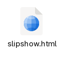
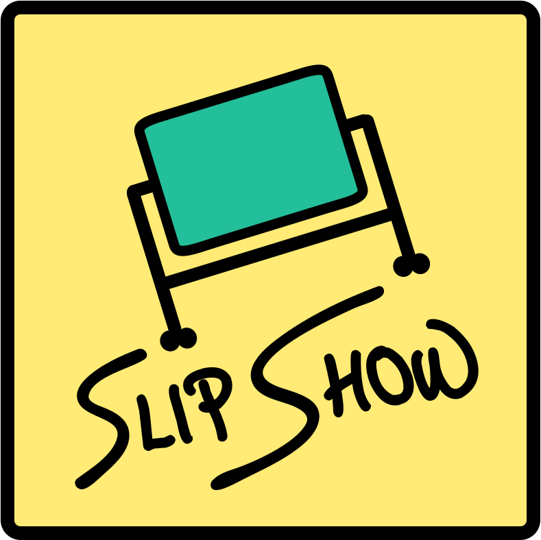

<style>
#nuage-de-points.stop p {
  transition: opacity 1s, transform 1s;
  opacity: 0.1;
}
#nuage-de-points.stop.all-stop p {
  opacity: 1;
}
#nuage-de-points.stop #cmfiles.selected {
  transform: scale(2) translateX(50px);
}
#nuage-de-points.stop #not-bs.selected {
  transform: scale(2) translateX(-50px);
}
#nuage-de-points.stop #nbosbst.selected {
  transform: scale(2) translateX(150px) translateY(50px);
}
#nuage-de-points.stop #custom_script2.selected {
  transform: scale(2) translateX(-350px) translateY(-150px);
}
#nuage-de-points.stop #video.selected {
  transform: scale(2) translateX(150px) translateY(-100px);
}
#nuage-de-points.stop #embedded-pdfs.selected {
  transform: scale(2) translateX(-25px);
}
#nuage-de-points.stop #markdown-output.selected {
  transform: scale(2) translateX(-125px) translateY(25px);
}
#nuage-de-points.stop #hot-reloading.selected {
  transform: scale(2) translateX(125px) translateY(-75px);
}
#nuage-de-points.stop #available-vscode.selected {
  transform: scale(2) translateX(-125px) translateY(-140px);
}
#nuage-de-points.stop #available-gui.selected {
  transform: scale(2) translateY(-100px);
}
#nuage-de-points.stop #live-collab.selected {
  transform: scale(2) translateX(225px);
}
#nuage-de-points.stop #user-def-dim.selected {
  transform: scale(2) translateY(100px);
}
#nuage-de-points.stop #ext-doc-tut.selected {
  transform: scale(2) translateX(-150px);
}
#nuage-de-points.stop #hierar-pres.selected {
  transform: scale(2) translateX(300px);
}
#nuage-de-points.stop #satheorem.selected {
  transform: scale(2) translateX(-200px) translateY(100px);
}
#nuage-de-points.stop #offline-first.selected {
  transform: scale(2) translateX(-200px) translateY(100px);
}
#nuage-de-points.stop #versionning-friendly.selected {
  transform: scale(2) translateX(-200px) translateY(-100px);
}
#nuage-de-points.stop #friendly-community.selected {
  transform: scale(2) translateX(200px) translateY(-100px);
}
#nuage-de-points.stop #secure-by-design.selected {
  transform: scale(2) translateX(-200px) translateY(-100px);
}
#nuage-de-points.stop #no-llms.selected {
  transform: scale(2) translateX(200px) translateY(100px);
}
#nuage-de-points.stop #feature-toc.selected {
  transform: scale(2) translateX(-200px);
}
#nuage-de-points.stop .selected {
  opacity: 1;
  transform: scale(2);
}
#nuage-de-points.stop .finished {
  transform: scale(1);
  opacity: 0;
}
#nuage-de-points {
  display: flex;
  flex-wrap: wrap;
  gap: 0px;
  column-gap: 157px;
  font-size: 1.2em;
  justify-content: space-around;
}
#nuage-de-points p {
  margin-top: 20px;
  margin-bottom: 20px;
}
.abs {
  position: absolute;
}
#no-llms {
  top: 90px;
  left: 30px;
}
#compat-pointer {
  top: 590px;
  left: 530px;
  transform: rotate(40deg);
}
#can-make-coffee {
  top: 350px;
  left: 930px;
}
#nlnet-sponsored {
  top: 280px;
  left: 990px;
  transform: rotate(-10deg);
}
#type-safe {
  top: 230px;
  left: 390px;
  transform: rotate(-180deg);
}
#live-collab {
  top: 430px;
  left: -150px;
  transform: rotate(90deg);
}
#syntax-high {
  top: 530px;
  left: 870px;
  transform: rotate(-30deg);
}
#offline-first {
  top: 30px;
  left: 1670px;
  transform: rotate(-10deg);
}
#satheorem {
  top: 650px;
  left: 1170px;
  transform:  translateX(350px) rotate(-90deg);
}
#adaptative-scaling {
  top: 880px;
  left: 570px;
  transform:  translateX(350px) rotate(-55deg);
}
#user-def-dim {
  top: 90px;
  left: 570px;
}
#math_support {
  top: 180px;
  left: 1200px;
  transform: rotate(35deg);
}
#frame.stop {
  opacity: 1;
}
#frame {
  transition: opacity 3s;
  transition-delay: 2s;
  opacity: 0;
  position: absolute;
  top: 370px;
  left: 50px;
  width: 600px;
  height: 400px;
//  background-color: rgba(255,0,0,0.5);
  overflow: visible;
}
#rec1 {
  transform:  translate(-350px, -150px) scale(0.4);
}
</style>

# Slipshow: A *full-featured* presentation tool

{#nuage-de-points children:pause}
---

{#cmfiles}
Compile markdown files

{#gen-stand}
Generate *Standalone* HTML files

{#not-bs}
Not based on slides

{#can-zoom}
Can Zoom

{#can-annotate}
You can annotate your presentation

{#custom_script}
Custom scripts

{#hot-reloading}
Write your presentation with hot-reloading

{#embedded-pdfs}
Support for embedding PDFs

{#video}
Embed Videos and Audio

{#available-static}
Available as a static binary

{#available-vscode}
Available as a VSCode extension

{#available-gui}
Available with a GUI

{#bidirectional}
Bi-directional

{#feature-toc}
Features a table of content

{#feature-theme}
Has supports for themes

{#custom_script2}
Allow the execution of custom scripts

{#nbosbst}
Not based on slides (but supports them)

{#extensible-js}
Extensible via JavaScript

{#markdown-output}
Markdown output

{#has-speaker-view}
Speaker view

{#front-support}
Frontmatter support

{#mobile-support}
Mobile support

{#multi-input}
Multi-file input

{#hierar-pres}
Hierarchical presentation

{#many-predefined-actions}
Many predefined actions

{#ext-doc-tut}
Extensive documentation and tutorial

{#friendly-community}
Friendly community (me)

{#ext-help-page}
Extensive help page

{#open-source}
Open source

{#secure-by-design}
Secure-by-design

{#lightning-fast}
Lightning fast

{#has-nice-logo}
Has a nice logo

{#fun-name}
Fun name

{#versionning-friendly}
Versionning-friendly

{.abs #no-llms}
No LLM knows about it

{.abs #compat-pointer}
Compatible with pointer devices

{.abs #can-make-coffee}
Can make coffee

{.abs #nlnet-sponsored}
Sponsored by NLNet

{.abs #type-safe}
Type safe

{.abs #live-collab}
Live-collaboration editing

{.abs #syntax-high}
Syntax highlighting

{.abs #offline-first}
Offline first

{.abs #satheorem}
Support for environment such as `theorem`

{.abs #adaptative-scaling}
Adaptative scaling

{.abs #user-def-dim}
User-defined dimensions

{.abs #math_support speaker-note=sn-stop}
Mathematics support

---

{#sn-stop}
**STOOOOOOOOOOOOOOOOOOP**


<style>
#countdown-10 {
  position: absolute;
  z-index:100;
  top:0px;
  font-size: 3em;
  left:0px;
  background-color: lightgrey;
  padding: 10px;
  border: 1px solid black;
  border-radius: 10px;
}
</style>

{#countdown-10 .unstatic}

{exec static=countdown-10}
```slip-script
slip.setClass(document.querySelector("#nuage-de-points"), "stop", true);

function startCountdown(elementId) {
  const display = document.getElementById(elementId);
  let timeRemaining = 10 * 60; // 10 minutes in seconds
  function do_ () {
    const minutes = Math.floor(timeRemaining / 60);
    const seconds = timeRemaining % 60;

    display.textContent = `${minutes.toString().padStart(2, '0')}:${seconds.toString().padStart(2, '0')}`;

    timeRemaining--;

    if (timeRemaining < 0) {
        clearInterval(interval);
        display.textContent = "00:00";
    }
  }
  do_();
  const interval = setInterval(do_, 1000);

  return interval; // return the interval ID so it can be cancelled
}

// Start the countdown
const countdownInterval = startCountdown('countdown-10');
slip.state.cdi = countdownInterval;
// To cancel it:
slip.onUndo(() => clearInterval(countdownInterval));
```

{exec pause speaker-note=sn-actions}
```slip-script
slip.setClass(document.querySelector("#cmfiles"), "selected", true);
```

{#sn-actions}
Don't forget to speak about actions

<style>
.addons {
  position:absolute;
}
#cmf-addons {
  top:300px;
  left:600px;
  width: 900px;
  display: flex;
  justify-content: space-around;
  align-items: center;
}
.emphasized {
  font-weight: bold;
}
</style>

{#cmf-addons .addons .block}
> ```txt
> ## Title
>
> Wait for it...
>
> {pause}
>
> Surprise!{emph}
> ```
> ---
> [➡️]{style="font-size: 3em"}
>
> ---
>
> ## Title
>
> Wait for it...
>
> {pause}
>
> Surprise!{emph}

{exec pause unstatic=cmf-addons}
```slip-script
slip.setClass(document.querySelector("#cmfiles"), "finished", true);
slip.setClass(document.querySelector("#cmfiles"), "selected", false);
slip.setClass(document.querySelector("#gen-stand"), "selected", true);
```

<style>
#icon {
  top:400px;
  left:600px;
  width:400px;
  text-align: center;
}
#icon img {
  width:300px;
}
</style>

{#icon .addons .block}
 <!-- TODO: turn into a gif -->

{exec unstatic=icon pause}
```slip-script
slip.setClass(document.querySelector("#gen-stand"), "finished", true);
slip.setClass(document.querySelector("#gen-stand"), "selected", false);
slip.setClass(document.querySelector("#not-bs"), "selected", true);
```

<style>
#nbos {
  top:300px;
  left:600px;
  width: 900px;
}
</style>

{#nbos .addons .block}
> We are still on slide 1?
> 

{exec pause unstatic=nbos}
```slip-script
slip.setClass(document.querySelector("#not-bs"), "finished", true);
slip.setClass(document.querySelector("#not-bs"), "selected", false);
slip.setClass(document.querySelector("#can-zoom"), "selected", true);
```

<style>
#cz-addons {
  top:300px;
  left:600px;
  width: 500px;
}
</style>

{#cz-addons .addons .block}
> ```
> {focus=can-zoom-popup}
> ```

{focus=cz-addons}

{unfocus}

{exec pause unstatic=cz-addons}
```slip-script
slip.setClass(document.querySelector("#can-zoom"), "finished", true);
slip.setClass(document.querySelector("#can-zoom"), "selected", false);
slip.setClass(document.querySelector("#nbosbst"), "selected", true);
```

<style>
#nbbs-addons {
  top:000px;
  left:600px;
  width: 1000px;
}
</style>

{#nbbs-addons .addons .block carousel change-page=~n:all children:slide children:no-enter}
>
> # Slide 1
>
> Lorem ipsum 
>
> - Content 1
>
> - Content 2
>
> ---
> # Slide 2
> Another content

{exec pause unstatic=nbbs-addons}
```slip-script
slip.setClass(document.querySelector("#nbosbst"), "finished", true);
slip.setClass(document.querySelector("#nbosbst"), "selected", false);
slip.setClass(document.querySelector("#can-annotate"), "selected", true);
```

{exec pause unstatic=nbbs-addons}
```slip-script
slip.setClass(document.querySelector("#can-annotate"), "finished", true);
slip.setClass(document.querySelector("#can-annotate"), "selected", false);
slip.setClass(document.querySelector("#custom_script"), "selected", true);
slip.setClass(document.querySelector("#custom_script2"), "selected", true);
```


<style>
#custscript-addons {
  top:450px;
  left:50px;
  width: 1300px;
  display: flex;
  justify-content: space-around;
  align-items: center;
}
</style>

{#custscript-addons .addons .block}
> ````
> - Some
> - bullet
> - points
>
> {exec}
> ```slip-script
> document.querySelectorAll("li").
>   forEach((elem) => {
>     slip.setClass(elem, "red", true)
>   })
> ```
> ````
> ---
> [➡️]{style="font-size: 3em"}
>
> ---
>
> {#bpex}
> - Some
> - bullet
> - points
>
> {exec}
> ```slip-script
> document.querySelectorAll("#bpex li").
>   forEach((elem) => {
>     slip.setClass(elem, "tored", true)
>   })
> ```
>
> <style> .tored { background-color: red; } </style>


{exec pause unstatic=custscript-addons}
```slip-script
slip.setClass(document.querySelector("#custom_script"), "finished", true);
slip.setClass(document.querySelector("#custom_script"), "selected", false);
slip.setClass(document.querySelector("#custom_script2"), "finished", true);
slip.setClass(document.querySelector("#custom_script2"), "selected", false);
slip.setClass(document.querySelector("#bidirectional"), "selected", true);
```

{exec pause unstatic=nbbs-addons speaker-note=sn-slipshow-has-support-for-videos}
```slip-script
slip.setClass(document.querySelector("#bidirectional"), "finished", true);
slip.setClass(document.querySelector("#bidirectional"), "selected", false);
slip.setClass(document.querySelector("#video"), "selected", true);
```

{#sn-slipshow-has-support-for-videos}
Say: "Slipshow has support for videos"

<style>
#video-demo {
  top:300px;
  left:200px;
  width: 1050px;
}
</style>

{#video-demo .addons .block external}
> {style=width:100% #videoelem}

{play-media=videoelem}

{exec pause unstatic=video-demo}
```slip-script
slip.setClass(document.querySelector("#video"), "finished", true);
slip.setClass(document.querySelector("#video"), "selected", false);
slip.setClass(document.querySelector("#embedded-pdfs"), "selected", true);
```


<style>
#pdf-demo {
  top:100px;
  left:200px;
  width: 650px;
}
</style>

{#pdf-demo .addons .block}
> {style=width:600px change-page="~n:2-40" #the-pdf}

{change-page="~n:all the-pdf" speaker-note=sn-pdf-end}

{#sn-pdf-end}
**PDF almost finished**


{exec pause unstatic=pdf-demo}
```slip-script
slip.setClass(document.querySelector("#embedded-pdfs"), "finished", true);
slip.setClass(document.querySelector("#embedded-pdfs"), "selected", false);
slip.setClass(document.querySelector("#feature-toc"), "selected", true);
```

{exec pause unstatic=nbbs-addons}
```slip-script
slip.setClass(document.querySelector("#feature-toc"), "finished", true);
slip.setClass(document.querySelector("#feature-toc"), "selected", false);
slip.setClass(document.querySelector("#feature-theme"), "selected", true);
```

{exec pause unstatic=nbbs-addons}
```slip-script
slip.setClass(document.querySelector("#feature-theme"), "finished", true);
slip.setClass(document.querySelector("#feature-theme"), "selected", false);
slip.setClass(document.querySelector("#markdown-output"), "selected", true);
```

<style>
#mout-addons {
  top:150px;
  left:10px;
  width: 1300px;
  display: flex;
  justify-content: space-around;
  align-items: center;
}
</style>

{#mout-addons .addons .block}
> ```
> ## Title
>
> Wait for it...
>
> {pause}
>
> **Surprise!**
> ```
> ---
> [➡️]{style="font-size: 3em"}
>
> ---
>
> ```
> ## Title
>
> Wait for it...
>
> **Surprise!**
> ```


{exec pause unstatic=mout-addons}
```slip-script
slip.setClass(document.querySelector("#markdown-output"), "finished", true);
slip.setClass(document.querySelector("#markdown-output"), "selected", false);
slip.setClass(document.querySelector("#hot-reloading"), "selected", true);
```

{#static-hot-reload .addons .block}
> {play-media}

<style>
#static-hot-reload {
  top:350px;
  padding-top: 0;
  left:00px;
  width: 1850px;
}
</style>


{exec pause unstatic=static-hot-reload}
```slip-script
slip.setClass(document.querySelector("#hot-reloading"), "finished", true);
slip.setClass(document.querySelector("#hot-reloading"), "selected", false);
slip.setClass(document.querySelector("#available-static"), "selected", true);
```

<style>
#static-bin-av {
  top:600px;
  left:00px;
  width: 1850px;
}
</style>

{#static-bin-av .addons .block}
> ```
> $ wget https://github.com/panglesd/slipshow/releases/download/v0.6.0/slipshow-linux-x86_64.tar
> $ tar xvf slipshow-linux-x86_64.tar
> $ cp bin/slipshow /usr/bin/slipshow
> ```


{exec pause unstatic=static-bin-av}
```slip-script
slip.setClass(document.querySelector("#available-static"), "finished", true);
slip.setClass(document.querySelector("#available-static"), "selected", false);
slip.setClass(document.querySelector("#available-vscode"), "selected", true);
```

{#static-vscode .addons .block}
> {play-media}


<style>
#static-vscode {
  top:200px;
  padding-top: 0;
  left:00px;
  width: 1850px;
}
</style>


{exec pause unstatic=static-vscode}
```slip-script
slip.setClass(document.querySelector("#available-vscode"), "finished", true);
slip.setClass(document.querySelector("#available-vscode"), "selected", false);
slip.setClass(document.querySelector("#available-gui"), "selected", true);
```


<style>
#av-gui {
  top:120px;
  left:800px;
  text-align: center;
  width: 850px;
}
</style>

{#av-gui .addons .block}
Made with {style=background-color:#272727;padding:20px;vertical-align:middle}

{#static-gui .addons .block}
> {play-media}


<style>
#static-gui {
  top:400px;
  padding-top: 0;
  left:00px;
  width: 1850px;
}
</style>


{exec pause unstatic="av-gui static-gui"}
```slip-script
slip.setClass(document.querySelector("#available-gui"), "finished", true);
slip.setClass(document.querySelector("#available-gui"), "selected", false);
slip.setClass(document.querySelector("#live-collab"), "selected", true);
```

<style>
#shlink {
  top:600px;
  left:700px;
  text-align: center;
  width: 850px;
}
</style>

{#shlink .addons .block}
See <https://sliphub.choum.net/funocaml>


{exec pause unstatic=shlink}
```slip-script
slip.setClass(document.querySelector("#live-collab"), "finished", true);
slip.setClass(document.querySelector("#live-collab"), "selected", false);
slip.setClass(document.querySelector("#extensible-js"), "selected", true);
```

{exec pause unstatic=nbbs-addons speaker-note=spvtosend1p1}
```slip-script
slip.setClass(document.querySelector("#extensible-js"), "finished", true);
slip.setClass(document.querySelector("#extensible-js"), "selected", false);
slip.setClass(document.querySelector("#has-speaker-view"), "selected", true);
```

{#spvtosend1p1}
> {#spvtosend2}
> ---
> Don't forget to show the speaker view.
>
> <style>
> #spvtosend2 blockquote {
> padding: 0 1em;
> padding-right: 0;
> color: #59636e;
> border-left: .25em solid #d1d9e0;
> }
> </style>

{speaker-note}
> {#spvtosend3}
> ---
> Don't forget to show the speaker view.
>
> <style>
> #spvtosend3 blockquote {
> padding: 0 1em;
> padding-right: 0;
> color: #59636e;
> border-left: .25em solid #d1d9e0;
> }
> </style>
>
> Don't forget to show the:
> 
> {blockquote}
> > Don't forget to show the speaker view.
>
> note.

{speaker-note}
> {#spvtosend4}
> ---
> Don't forget to show the speaker view.
>
> <style>
> #spvtosend4 blockquote {
> padding: 0 1em;
> padding-right: 0;
> color: #59636e;
> border-left: .25em solid #d1d9e0;
> }
> </style>
>
> Don't forget to show the:
> 
> {blockquote}
> > Don't forget to show the speaker view.
>
> note.
>
> Don't forget to show the:
> 
> {blockquote}
> > Don't forget to show the:
> > 
> > {blockquote}
> > > Don't forget to show the speaker view.
> >
> > note.
>
> note.
>
>
>
> Don't forget to show the:
>
> {blockquote}
> > Don't forget to show the:
> > 
> > {blockquote}
> > > Don't forget to show the:
> > > 
> > > {blockquote}
> > > > Don't forget to show the speaker view.
> > >
> > > note.
> >
> > note.
>
> note.
>
>
>
>
> Don't forget to show the:
>
> {blockquote}
> > Don't forget to show the:
> >
> > {blockquote}
> > > Don't forget to show the:
> > > 
> > > {blockquote}
> > > > Don't forget to show the:
> > > > 
> > > > {blockquote}
> > > > > Don't forget to show the speaker view.
> > > >
> > > > note.
> > >
> > > note.
> >
> > note.
>
> note.
>
>
> <!-- STOP -->
>
>
>
> Don't forget to show the:
>
> {blockquote}
> > Don't forget to show the:
> >
> > {blockquote}
> > > Don't forget to show the:
> > >
> > > {blockquote}
> > > > Don't forget to show the:
> > > > 
> > > > {blockquote}
> > > > > Don't forget to show the:
> > > > > 
> > > > > {blockquote}
> > > > > > Don't forget to show the speaker view.
> > > > >
> > > > > note.
> > > >
> > > > note.
> > >
> > > note.
> >
> > note.
>
> note.>
>
> Don't forget to show the:
>
> {blockquote}
> > Don't forget to show the:
> >
> > {blockquote}
> > > Don't forget to show the:
> > >
> > > {blockquote}
> > > > Don't forget to show the:
> > > >
> > > > {blockquote}
> > > > > Don't forget to show the:
> > > > > 
> > > > > {blockquote}
> > > > > > Don't forget to show the:
> > > > > > 
> > > > > > {blockquote}
> > > > > > > Don't forget to show the speaker view.
> > > > > >
> > > > > > note.
> > > > >
> > > > > note.
> > > >
> > > > note.
> > >
> > > note.
> >
> > note.
>
> note.>
>
> Don't forget to show the:
>
> {blockquote}
> > Don't forget to show the:
> >
> > {blockquote}
> > > Don't forget to show the:
> > >
> > > {blockquote}
> > > > Don't forget to show the:
> > > >
> > > > {blockquote}
> > > > > Don't forget to show the:
> > > > >
> > > > > {blockquote}
> > > > > > Don't forget to show the:
> > > > > > 
> > > > > > {blockquote}
> > > > > > > Don't forget to show the:
> > > > > > > 
> > > > > > > {blockquote}
> > > > > > > > Don't forget to show the speaker view.
> > > > > > >
> > > > > > > note.
> > > > > >
> > > > > > note.
> > > > >
> > > > > note.
> > > >
> > > > note.
> > >
> > > note.
> >
> > note.
>
> note.>
>
> Don't forget to show the:
>
> {blockquote}
> > Don't forget to show the:
> >
> > {blockquote}
> > > Don't forget to show the:
> > >
> > > {blockquote}
> > > > Don't forget to show the:
> > > >
> > > > {blockquote}
> > > > > Don't forget to show the:
> > > > >
> > > > > {blockquote}
> > > > > > Don't forget to show the:
> > > > > >
> > > > > > {blockquote}
> > > > > > > Don't forget to show the:
> > > > > > > 
> > > > > > > {blockquote}
> > > > > > > > Don't forget to show the:
> > > > > > > > 
> > > > > > > > {blockquote}
> > > > > > > > > Don't forget to show the speaker view.
> > > > > > > >
> > > > > > > > note.
> > > > > > >
> > > > > > > note.
> > > > > >
> > > > > > note.
> > > > >
> > > > > note.
> > > >
> > > > note.
> > >
> > > note.
> >
> > note.
>
> note.>
>
> Don't forget to show the:
>
> {blockquote}
> > Don't forget to show the:
> >
> > {blockquote}
> > > Don't forget to show the:
> > >
> > > {blockquote}
> > > > Don't forget to show the:
> > > >
> > > > {blockquote}
> > > > > Don't forget to show the:
> > > > >
> > > > > {blockquote}
> > > > > > Don't forget to show the:
> > > > > >
> > > > > > {blockquote}
> > > > > > > Don't forget to show the:
> > > > > > >
> > > > > > > {blockquote}
> > > > > > > > Don't forget to show the:
> > > > > > > > 
> > > > > > > > {blockquote}
> > > > > > > > > Don't forget to show the:
> > > > > > > > > 
> > > > > > > > > {blockquote}
> > > > > > > > > > Don't forget to show the speaker view.
> > > > > > > > >
> > > > > > > > > note.
> > > > > > > >
> > > > > > > > note.
> > > > > > >
> > > > > > > note.
> > > > > >
> > > > > > note.
> > > > >
> > > > > note.
> > > >
> > > > note.
> > >
> > > note.
> >
> > note.
>
> note.>
>
> Don't forget to show the:
>
> {blockquote}
> > Don't forget to show the:
> >
> > {blockquote}
> > > Don't forget to show the:
> > >
> > > {blockquote}
> > > > Don't forget to show the:
> > > >
> > > > {blockquote}
> > > > > Don't forget to show the:
> > > > >
> > > > > {blockquote}
> > > > > > Don't forget to show the:
> > > > > >
> > > > > > {blockquote}
> > > > > > > Don't forget to show the:
> > > > > > >
> > > > > > > {blockquote}
> > > > > > > > Don't forget to show the:
> > > > > > > >
> > > > > > > > {blockquote}
> > > > > > > > > Don't forget to show the:
> > > > > > > > > 
> > > > > > > > > {blockquote}
> > > > > > > > > > Don't forget to show the:
> > > > > > > > > > 
> > > > > > > > > > {blockquote}
> > > > > > > > > > > Don't forget to show the speaker view.
> > > > > > > > > >
> > > > > > > > > > note.
> > > > > > > > >
> > > > > > > > > note.
> > > > > > > >
> > > > > > > > note.
> > > > > > >
> > > > > > > note.
> > > > > >
> > > > > > note.
> > > > >
> > > > > note.
> > > >
> > > > note.
> > >
> > > note.
> >
> > note.
>
> note.>
>
> Don't forget to show the:
>
> {blockquote}
> > Don't forget to show the:
> >
> > {blockquote}
> > > Don't forget to show the:
> > >
> > > {blockquote}
> > > > Don't forget to show the:
> > > >
> > > > {blockquote}
> > > > > Don't forget to show the:
> > > > >
> > > > > {blockquote}
> > > > > > Don't forget to show the:
> > > > > >
> > > > > > {blockquote}
> > > > > > > Don't forget to show the:
> > > > > > >
> > > > > > > {blockquote}
> > > > > > > > Don't forget to show the:
> > > > > > > >
> > > > > > > > {blockquote}
> > > > > > > > > Don't forget to show the:
> > > > > > > > >
> > > > > > > > > {blockquote}
> > > > > > > > > > Don't forget to show the:
> > > > > > > > > > 
> > > > > > > > > > {blockquote}
> > > > > > > > > > > Don't forget to show the:
> > > > > > > > > > > 
> > > > > > > > > > > {blockquote}
> > > > > > > > > > > > Don't forget to show the speaker view.
> > > > > > > > > > >
> > > > > > > > > > > note.
> > > > > > > > > >
> > > > > > > > > > note.
> > > > > > > > >
> > > > > > > > > note.
> > > > > > > >
> > > > > > > > note.
> > > > > > >
> > > > > > > note.
> > > > > >
> > > > > > note.
> > > > >
> > > > > note.
> > > >
> > > > note.
> > >
> > > note.
> >
> > note.
>
> note.>
>
> Don't forget to show the:
>
> {blockquote}
> > Don't forget to show the:
> >
> > {blockquote}
> > > Don't forget to show the:
> > >
> > > {blockquote}
> > > > Don't forget to show the:
> > > >
> > > > {blockquote}
> > > > > Don't forget to show the:
> > > > >
> > > > > {blockquote}
> > > > > > Don't forget to show the:
> > > > > >
> > > > > > {blockquote}
> > > > > > > Don't forget to show the:
> > > > > > >
> > > > > > > {blockquote}
> > > > > > > > Don't forget to show the:
> > > > > > > >
> > > > > > > > {blockquote}
> > > > > > > > > Don't forget to show the:
> > > > > > > > >
> > > > > > > > > {blockquote}
> > > > > > > > > > Don't forget to show the:
> > > > > > > > > >
> > > > > > > > > > {blockquote}
> > > > > > > > > > > Don't forget to show the:
> > > > > > > > > > > 
> > > > > > > > > > > {blockquote}
> > > > > > > > > > > > Don't forget to show the:
> > > > > > > > > > > > 
> > > > > > > > > > > > {blockquote}
> > > > > > > > > > > > > Don't forget to show the speaker view.
> > > > > > > > > > > >
> > > > > > > > > > > > note.
> > > > > > > > > > >
> > > > > > > > > > > note.
> > > > > > > > > >
> > > > > > > > > > note.
> > > > > > > > >
> > > > > > > > > note.
> > > > > > > >
> > > > > > > > note.
> > > > > > >
> > > > > > > note.
> > > > > >
> > > > > > note.
> > > > >
> > > > > note.
> > > >
> > > > note.
> > >
> > > note.
> >
> > note.
>
> note.>
>
> Don't forget to show the:
>
> {blockquote}
> > Don't forget to show the:
> >
> > {blockquote}
> > > Don't forget to show the:
> > >
> > > {blockquote}
> > > > Don't forget to show the:
> > > >
> > > > {blockquote}
> > > > > Don't forget to show the:
> > > > >
> > > > > {blockquote}
> > > > > > Don't forget to show the:
> > > > > >
> > > > > > {blockquote}
> > > > > > > Don't forget to show the:
> > > > > > >
> > > > > > > {blockquote}
> > > > > > > > Don't forget to show the:
> > > > > > > >
> > > > > > > > {blockquote}
> > > > > > > > > Don't forget to show the:
> > > > > > > > >
> > > > > > > > > {blockquote}
> > > > > > > > > > Don't forget to show the:
> > > > > > > > > >
> > > > > > > > > > {blockquote}
> > > > > > > > > > > Don't forget to show the:
> > > > > > > > > > >
> > > > > > > > > > > {blockquote}
> > > > > > > > > > > > Don't forget to show the:
> > > > > > > > > > > > 
> > > > > > > > > > > > {blockquote}
> > > > > > > > > > > > > Don't forget to show the:
> > > > > > > > > > > > > 
> > > > > > > > > > > > > {blockquote}
> > > > > > > > > > > > > > Don't forget to show the speaker view.
> > > > > > > > > > > > >
> > > > > > > > > > > > > note.
> > > > > > > > > > > >
> > > > > > > > > > > > note.
> > > > > > > > > > >
> > > > > > > > > > > note.
> > > > > > > > > >
> > > > > > > > > > note.
> > > > > > > > >
> > > > > > > > > note.
> > > > > > > >
> > > > > > > > note.
> > > > > > >
> > > > > > > note.
> > > > > >
> > > > > > note.
> > > > >
> > > > > note.
> > > >
> > > > note.
> > >
> > > note.
> >
> > note.
>
> note.>
>
> Don't forget to show the:
>
> {blockquote}
> > Don't forget to show the:
> >
> > {blockquote}
> > > Don't forget to show the:
> > >
> > > {blockquote}
> > > > Don't forget to show the:
> > > >
> > > > {blockquote}
> > > > > Don't forget to show the:
> > > > >
> > > > > {blockquote}
> > > > > > Don't forget to show the:
> > > > > >
> > > > > > {blockquote}
> > > > > > > Don't forget to show the:
> > > > > > >
> > > > > > > {blockquote}
> > > > > > > > Don't forget to show the:
> > > > > > > >
> > > > > > > > {blockquote}
> > > > > > > > > Don't forget to show the:
> > > > > > > > >
> > > > > > > > > {blockquote}
> > > > > > > > > > Don't forget to show the:
> > > > > > > > > >
> > > > > > > > > > {blockquote}
> > > > > > > > > > > Don't forget to show the:
> > > > > > > > > > >
> > > > > > > > > > > {blockquote}
> > > > > > > > > > > > Don't forget to show the:
> > > > > > > > > > > >
> > > > > > > > > > > > {blockquote}
> > > > > > > > > > > > > Don't forget to show the:
> > > > > > > > > > > > > 
> > > > > > > > > > > > > {blockquote}
> > > > > > > > > > > > > > Don't forget to show the:
> > > > > > > > > > > > > > 
> > > > > > > > > > > > > > {blockquote}
> > > > > > > > > > > > > > > Don't forget to show the speaker view.
> > > > > > > > > > > > > >
> > > > > > > > > > > > > > note.
> > > > > > > > > > > > >
> > > > > > > > > > > > > note.
> > > > > > > > > > > >
> > > > > > > > > > > > note.
> > > > > > > > > > >
> > > > > > > > > > > note.
> > > > > > > > > >
> > > > > > > > > > note.
> > > > > > > > >
> > > > > > > > > note.
> > > > > > > >
> > > > > > > > note.
> > > > > > >
> > > > > > > note.
> > > > > >
> > > > > > note.
> > > > >
> > > > > note.
> > > >
> > > > note.
> > >
> > > note.
> >
> > note.
>
> note.
>
<!-- > Don't forget to show the "Don't forget to show the speaker view" note. -->
<!-- > -->
<!-- > Don't forget to show the "Don't forget to show the "Don't forget to show the speaker view" note." note. -->
<!-- > -->
<!-- > Don't forget to show the "Don't forget to show the "Don't forget to show the "Don't forget to show the speaker view" note." note." note. -->
<!-- > -->
<!-- > Don't forget to show the "Don't forget to show the "Don't forget to show the "Don't forget to show the "Don't forget to show the speaker view" note." note." note." note. -->
<!-- > -->
<!-- > Don't forget to show the "Don't forget to show the "Don't forget to show the "Don't forget to show the "Don't forget to show the "Don't forget to show the speaker view" note." note." note." note." note. -->
<!-- > -->
<!-- > Don't forget to show the "Don't forget to show the "Don't forget to show the "Don't forget to show the "Don't forget to show the "Don't forget to show the "Don't forget to show the speaker view" note." note." note." note." note." note. -->


{exec pause unstatic=nbbs-addons}
```slip-script
slip.setClass(document.querySelector("#has-speaker-view"), "finished", true);
slip.setClass(document.querySelector("#has-speaker-view"), "selected", false);
slip.setClass(document.querySelector("#multi-input"), "selected", true);
```


<style>
#inclde {
  top:200px;
  left:200px;
  width: 850px;
}
</style>

{#inclde .addons .block}
> ```
> # Chapter 1
>
> {include src="chapter1.md"}
>
> # Chapter 2
>
> {include src="chapter2.md"}
> ```

{exec pause unstatic=inclde}
```slip-script
slip.setClass(document.querySelector("#multi-input"), "finished", true);
slip.setClass(document.querySelector("#multi-input"), "selected", false);
slip.setClass(document.querySelector("#front-support"), "selected", true);
```

<style>
#fmspt {
  top:200px;
  left:600px;
  width: 850px;
}
</style>

{#fmspt .addons .block}
> ```
> ---
> theme: default
> dimension: 16:9
> ---
> Content
> ```

{exec pause unstatic=fmspt}
```slip-script
slip.setClass(document.querySelector("#front-support"), "finished", true);
slip.setClass(document.querySelector("#front-support"), "selected", false);
slip.setClass(document.querySelector("#adaptative-scaling"), "selected", true);
```

{exec pause unstatic=nbbs-addons}
```slip-script
slip.setClass(document.querySelector("#adaptative-scaling"), "finished", true);
slip.setClass(document.querySelector("#adaptative-scaling"), "selected", false);
slip.setClass(document.querySelector("#math_support"), "selected", true);
```

<style>
#math-addons {
  top:450px;
  left:10px;
  width: 1700px;
  display: flex;
  justify-content: space-around;
  align-items: center;
}
</style>

{#math-addons .addons .block}
> ````
> The complexity is in $\mathcal O(\infty)$,
> because:
>
> ```math
> \frac
>   {\Gamma, x : \tau_1 \vdash e : \tau_2}
>   {\Gamma \vdash \lambda x.e : \tau_1 \to \tau_2}
> ```
> ````
> ---
> [➡️]{style="font-size: 3em"}
>
> ---
>
> The complexity is in $\mathcal O(\infty)$, because:
>
> ```math
> \frac{\Gamma, x : \tau_1 \vdash e : \tau_2}
>     {\Gamma \vdash \lambda x.e : \tau_1 \to \tau_2}
> ```

{exec pause unstatic=math-addons}
```slip-script
slip.setClass(document.querySelector("#math_support"), "finished", true);
slip.setClass(document.querySelector("#math_support"), "selected", false);
slip.setClass(document.querySelector("#open-source"), "selected", true);
```


<style>
#ops {
  top:200px;
  left:600px;
  width: 850px;
}
</style>

{#ops .addons .block}
> [https://github.com/panglesd/slipshow](https://github.com/panglesd/slipshow)


{exec pause unstatic=ops}
```slip-script
slip.setClass(document.querySelector("#open-source"), "finished", true);
slip.setClass(document.querySelector("#open-source"), "selected", false);
slip.setClass(document.querySelector("#user-def-dim"), "selected", true);
```

<style>
#ratios {
  top:500px;
  left:500px;
  width: 1250px;
}
#seize-neuf{
  display: inline-block;
  background-color: lightgrey;
  border: 1px solid black;
  width: 480px;
  height: 270px;
}
#quatre-tiers{
  display: inline-block;
  background-color: lightgrey;
  border: 1px solid black;
  width: 400px;
  height: 300px;
}
#absurdratio {
  display: inline-block;
  background-color: lightgrey;
  border: 1px solid black;
  width: 120px;
  height: 268px;
}
</style>

{#ratios .addons .block}
> {#seize-neuf} or {#quatre-tiers} or {#absurdratio} or ...


{exec pause unstatic=ratios}
```slip-script
slip.setClass(document.querySelector("#user-def-dim"), "finished", true);
slip.setClass(document.querySelector("#user-def-dim"), "selected", false);
slip.setClass(document.querySelector("#ext-help-page"), "selected", true);
```


<style>
#ext-help-p {
  top:00px;
  left:100px;
  width: 1650px;
  height:700px;
  overflow: scroll;
}
</style>

{#ext-help-p .addons .block}
> ```
> SLIPSHOW(1)                     Slipshow Manual                    SLIPSHOW(1)
>
> NAME
>        slipshow - A tool to compile and preview slipshow presentation
>
> SYNOPSIS
>        slipshow COMMAND …
>
> COMMANDS
>        compile [OPTION]… [FILE.md]
>            Compile a slipshow source file into a slipshow html presentation
>
>        markdown [OPTION]… [FILE.md]
>            Compile  a  slipshow  source into a pure Markdown file, effectively
>            removing presentation attributes
>
>        serve [OPTION]… [FILE.md]
>            Serve a live preview of a slipshow presentation, with hot-reloading
>
>        themes [COMMAND] …
>            Manages themes for slipshow presentations
>
> COMMON OPTIONS
>        --help[=FMT] (default=auto)
>            Show this help in format FMT. The value FMT must be  one  of  auto,
>            pager,  groff  or  plain.  With  auto, the format is pager or plain
>            whenever the TERM env var is dumb or undefined.
>
>        --version
>            Show version information.
>
> EXIT STATUS
>        slipshow exits with:
>
>        0   on success.
>
>        123 on indiscriminate errors reported on standard error.
>
>        124 on command line parsing errors.
>
>        125 on unexpected internal errors (bugs).
>
> Slipshow 11VERSION11: The King's Sl...                             SLIPSHOW(1)
> ```


{exec pause unstatic=ext-help-p}
```slip-script
slip.setClass(document.querySelector("#ext-help-page"), "finished", true);
slip.setClass(document.querySelector("#ext-help-page"), "selected", false);
slip.setClass(document.querySelector("#ext-doc-tut"), "selected", true);
```

<style>
#rtdd {
  top:200px;
  left:600px;
  width: 850px;
}
</style>

{#rtdd .addons .block}
> [https://slipshow.readthedocs.io/](https://slipshow.readthedocs.io/)

{exec pause unstatic=rtdd}
```slip-script
slip.setClass(document.querySelector("#ext-doc-tut"), "finished", true);
slip.setClass(document.querySelector("#ext-doc-tut"), "selected", false);
slip.setClass(document.querySelector("#hierar-pres"), "selected", true);
```

<style>
#hierarchy-explained {
  top:200px;
  left:200px;
  width: 1350px;
  display: flex
}
</style>

{#hierarchy-explained .addons .block}
> {slide}
> ---
>
> [PART 1]{style="font-size:3em"}
>
> ---
> {step}
>
> {slide}
> ---
> [PART 2]{style="font-size:3em"}
>

{step}

{exec pause unstatic=hierarchy-explained}
```slip-script
slip.setClass(document.querySelector("#hierar-pres"), "finished", true);
slip.setClass(document.querySelector("#hierar-pres"), "selected", false);
slip.setClass(document.querySelector("#syntax-high"), "selected", true);
```

<style>
#shlt {
  top:200px;
  left:600px;
  width: 850px;
}
</style>

{#shlt .addons .block}
> ```ocaml
> let x = fun _ -> "hello" +. 3
> ```


{exec pause unstatic=shlt}
```slip-script
slip.setClass(document.querySelector("#syntax-high"), "finished", true);
slip.setClass(document.querySelector("#syntax-high"), "selected", false);
slip.setClass(document.querySelector("#mobile-support"), "selected", true);
```

{exec pause unstatic=nbbs-addons}
```slip-script
slip.setClass(document.querySelector("#mobile-support"), "finished", true);
slip.setClass(document.querySelector("#mobile-support"), "selected", false);
slip.setClass(document.querySelector("#satheorem"), "selected", true);
```

<style>
#theorems-demo {
  top:250px;
  left:50px;
  width: 1700px;
  display: flex;
  justify-content: space-around;
  align-items: center;
}
</style>

{#theorems-demo .addons .block}
> ````
> {.definition title="Halting problem"}
> Given an algorithm, output
> whether it will halt or loop.
>
> {.theorem}
> The halting problem cannot
> be solved by an algorithm.
> ````
> ---
> [➡️]{style="font-size: 3em"}
>
> ---
>
> {.definition title="Halting problem"}
> Given an algorithm, output
> whether it will halt or loop.
>
> {.theorem}
> The halting problem cannot
> be solved by an algorithm.


{exec pause unstatic=theorems-demo}
```slip-script
slip.setClass(document.querySelector("#satheorem"), "finished", true);
slip.setClass(document.querySelector("#satheorem"), "selected", false);
slip.setClass(document.querySelector("#nlnet-sponsored"), "selected", true);
```

<style>
#nlsponslogo {
  top:400px;
  left:200px;
  text-align: center;
  width: 850px;
}
</style>

{#nlsponslogo .addons .block}
{style=vertical-align:middle;width:400px}


{exec pause unstatic=nlsponslogo}
```slip-script
slip.setClass(document.querySelector("#nlnet-sponsored"), "finished", true);
slip.setClass(document.querySelector("#nlnet-sponsored"), "selected", false);
slip.setClass(document.querySelector("#lightning-fast"), "selected", true);
```

{exec pause unstatic=nbbs-addons}
```slip-script
slip.setClass(document.querySelector("#lightning-fast"), "finished", true);
slip.setClass(document.querySelector("#lightning-fast"), "selected", false);
slip.setClass(document.querySelector("#fun-name"), "selected", true);
```

<style>
#funname {
  top:400px;
  left:200px;
  text-align: center;
  width: 850px;
}
</style>

{#funname .addons .block}
The name is a pun on slideshows. No link with underwears.


{exec pause unstatic=funname}
```slip-script
slip.setClass(document.querySelector("#fun-name"), "finished", true);
slip.setClass(document.querySelector("#fun-name"), "selected", false);
slip.setClass(document.querySelector("#offline-first"), "selected", true);
```

{exec pause unstatic=nbbs-addons}
```slip-script
slip.setClass(document.querySelector("#offline-first"), "finished", true);
slip.setClass(document.querySelector("#offline-first"), "selected", false);
slip.setClass(document.querySelector("#many-predefined-actions"), "selected", true);
```

<style>
#mpda {
  top:400px;
  left:600px;
  text-align: center;
  width: 850px;
}
</style>

{#mpda .addons .block}
`pause`, `step`, `unstatic`, `static`, `unreveal`, `reveal`, `unfocus`,
`center`, `enter`, `down`, `focus`, `up`, `scroll`, `emph`, `unemph`, `execute`,
`play-media`, `change-page`, `speaker-note`.


{exec pause unstatic=mpda}
```slip-script
slip.setClass(document.querySelector("#many-predefined-actions"), "finished", true);
slip.setClass(document.querySelector("#many-predefined-actions"), "selected", false);
slip.setClass(document.querySelector("#has-nice-logo"), "selected", true);
```


<style>
#slslogo {
  top:200px;
  left:200px;
  text-align: center;
  width: 850px;
}
</style>

{#slslogo .addons .block}
{style=vertical-align:middle;width:400px}


{exec pause unstatic=slslogo}
```slip-script
slip.setClass(document.querySelector("#has-nice-logo"), "finished", true);
slip.setClass(document.querySelector("#has-nice-logo"), "selected", false);
slip.setClass(document.querySelector("#type-safe"), "selected", true);
```

{exec pause unstatic=nbbs-addons}
```slip-script
slip.setClass(document.querySelector("#type-safe"), "finished", true);
slip.setClass(document.querySelector("#type-safe"), "selected", false);
slip.setClass(document.querySelector("#compat-pointer"), "selected", true);
```

{exec pause unstatic=nbbs-addons}
```slip-script
slip.setClass(document.querySelector("#compat-pointer"), "finished", true);
slip.setClass(document.querySelector("#compat-pointer"), "selected", false);
slip.setClass(document.querySelector("#versionning-friendly"), "selected", true);
```

{exec pause unstatic=nbbs-addons}
```slip-script
slip.setClass(document.querySelector("#versionning-friendly"), "finished", true);
slip.setClass(document.querySelector("#versionning-friendly"), "selected", false);
slip.setClass(document.querySelector("#friendly-community"), "selected", true);
```

{exec pause unstatic=nbbs-addons}
```slip-script
slip.setClass(document.querySelector("#friendly-community"), "finished", true);
slip.setClass(document.querySelector("#friendly-community"), "selected", false);
slip.setClass(document.querySelector("#secure-by-design"), "selected", true);
```

{exec pause unstatic=nbbs-addons}
```slip-script
slip.setClass(document.querySelector("#secure-by-design"), "finished", true);
slip.setClass(document.querySelector("#secure-by-design"), "selected", false);
slip.setClass(document.querySelector("#no-llms"), "selected", true);
```

{exec pause unstatic=nbbs-addons}
```slip-script
slip.setClass(document.querySelector("#no-llms"), "finished", true);
slip.setClass(document.querySelector("#no-llms"), "selected", false);
slip.setClass(document.querySelector("#can-make-coffee"), "selected", true);
```

{exec pause unstatic=nbbs-addons}
```slip-script
slip.setClass(document.querySelector("#can-make-coffee"), "finished", true);
slip.setClass(document.querySelector("#can-make-coffee"), "selected", false);
clearInterval(slip.state.cdi)
```

{exec}
```slip-script
slip.setClass(document.querySelector(".stop"), "all-stop", true);
document.querySelectorAll(".finished").forEach((elem => {
  slip.setClass(elem, "finished", false);
}))
```

{draw #draw-links}

<!-- 1. Slipshow: Compile from markdown, to a standalone html file, not based on slides. -->
<!--   - Slipshow basics -->
<!--   - Actions -->
<!--   - Allow the execution of custom scripts -->
<!-- 2. Zoom, visual structure -->
<!--   - Just see this presentation -->
<!-- 3. Hot reloading and live-collaboration on sliphub -->
<!--   - Demonstration -->
<!--   - Call people to stress-test a sliphub presentation -->
<!--   - Explain that it's more complicated than it looks: explain the two panels -->
<!-- 4. Embed PDFs, video, audio -->
<!--   - Pdf: OCaml manual? -->
<!--   - Video: recursive video -->
<!-- 5. Speaker view -->
<!--   - Just a demo -->


<!-- --- -->
<!-- # The SECRET of how to achieve full-featuredness in 3 SIMPLE STEPS -->


<!-- ## 1. ORGANIZATION -->

<!-- Several team: -->
<!-- Engine   Runtime   Compiler   Language    Adoption    Ecosystem -->

<!-- Use Very Agile method -->

<!-- Many people working on it: -->
<!-- Back-end engineer: Paul-Elliot -->
<!-- Community manager: Paul-Elliot -->
<!-- MacOS specialist: Paul-Elliot -->
<!-- Front-end engineer: Paul-Elliot -->
<!-- Full-stack engineer: Paul-Elliot -->
<!-- UI/UX designer: Paul-Elliot -->
<!-- Distribution: Paul-Elliot -->
<!-- Marketing: Paul-Elliot -->
<!-- Technical Writer: Paul-Elliot -->
<!-- HR: Paul-Elliot -->
<!-- DevOps / Sysadmin: Paul-Elliot -->
<!-- QA / Tester: Paul-Elliot -->
<!-- Release Manager: Paul-Elliot -->
<!-- Documentation Writer: Paul-Elliot -->
<!-- Tech Support: Paul-Elliot -->
<!-- Product Manager: Paul-Elliot -->
<!-- Security Officer: Paul-Elliot -->
<!-- Legal Department: Paul-Elliot -->
<!-- Finance / Accounting: Paul-Elliot -->
<!-- Human Resources (HR): Paul-Elliot -->
<!-- Recruiter: Paul-Elliot -->
<!-- Data Analyst: Paul-Elliot -->
<!-- Customer Success: Paul-Elliot -->
<!-- Research & Development (R&D): Paul-Elliot -->
<!-- Ethics Board: Paul-Elliot -->
<!-- CEO / CTO / COO: Paul-Elliot -->
<!-- Intern: Paul-Elliot -->


<!-- ## 2. HYGIENE -->

<!-- All people working on Slipshow follow a strict hygiene of life to achieve greater efficiency: -->

<!-- - 5am – Waking up, -->
<!-- - 5:15am – Go for a footing, -->
<!-- - 6am – Sun salutations and stretching, -->
<!-- - 6:30 – Cold shower, -->
<!-- - 6:45 – eat vegan breakfast -->
<!-- - 7am – Solo Agile standup -->
<!-- - 8am-12pm – Pomodoro sessions with deep breathing in between -->
<!-- - 12pm-1pm – Fasting window (Yogi tea) -->
<!-- - 1pm – Squats and abs (10 reps). -->
<!-- - 1:30pm-5pm – Pomodoro sessions with deep breathing in between -->
<!-- - 5pm – No meeting -->

<!-- <\!-- Pay to unlock. I'll make it free but you can buy my other book, How to -->
<!-- achieve transcendence in three simple steps -\-> -->
<!-- ## 3. OCaml -->

<!-- Well, actually that is the main reason. -->

<!-- - A single language for browser and (static) native code -->
<!--   - Static typing, -->
<!--   - Precise compiler errors -->
<!-- TODO: demonstrate refactoring with Communication module -->
<!--   - Lovely syntax -->
<!-- TODO: speak about undo monad -->
<!--   - Many advanced features -->
<!--     - Functors and First class module: actions -->
<!--     - GADT: TODO -->
<!--     - Extensible variants: AST and Cmarkit -->
<!--     - Effects: I'm still trying -->
<!-- - Excellent tooling -->
<!--   - Dune -->
<!--     - Slipshow's build is complex -->
<!--     - Vendoring is easy -->
<!--     - Moving directories is easy -->
<!--     - Monorepoing is easy -->
<!--   - Merlin/Ocaml-lsp-server/Ocaml-eglot -->
<!--   - OCamlformat -->

<!-- (OCaml also has disappointed me. -->
<!--   * Only few choices between extra high quality libraries -->
<!--   * Compilation is a bit too fast -->
<!--   * Can't multiply a string and a float -->
<!--   * [...]) -->

<!-- # Conclusion -->

<!-- And the conclusion is that... -->

<!-- Slipshow has a lot of features ... (recommencer la présentation depuis le début) -->

<!-- Puis revenir au début et dire -->

<!-- There is NO conclusion. Use the tools you like to build the software you love. -->

<!-- <\!-- -->
<!--    Life is a process. Slipshow started as Javascript, it became OCaml, what will it be next I don't know. -->
<!--    Work on what you like -->

<!-- -\-> -->
